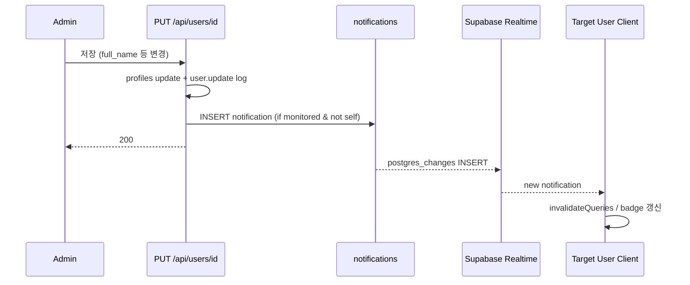

# 인앱 알림 MVP (user.update) 기획서

> Date: 2026-07-16  
> Status: Approved  
> Author: planner  
> **SQL:** `34` · `supabase/sql/34_notifications.sql` (구현 시)  
> **선행:** [03](./03_user-lifecycle-profile-plan.md), [04](./04_user-reactivate-plan.md), [08](./08_activity-audit-log-plan.md), [19](./19_user-single-name-plan.md), [21](./21_user-profile-slim-migration-plan.md), [22](./22_users-table-birthday-edit-init-plan.md), [25](./25_activity-logs-ui-improvement-plan.md)

## 선행 plan 참조 (Phase 0)

| Plan | 관계 |
|------|------|
| **03** | `PUT /api/users/[id]` inactive 차단 · **Realtime `postgres_changes`** 패턴 (`ProfileStatusRealtime`) — 본 plan은 `notifications` 테이블 INSERT 구독 |
| **04** | Users mutation `onSettled` invalidate — 알림 read mutation도 동일 패턴 |
| **08** | `user.update` activity log + `changed_fields` **유지** · 읽음 PATCH는 **신규 action** `notification.read` / `notification.read_all` |
| **19** | `full_name` 관리자 전용 수정 — 트리거 필드 |
| **21** | 조직 필드 `affiliation`·`rank` · 본인 `PATCH /api/profile` 403 — 알림 트리거는 admin `PUT`만 |
| **22** | `birthday` admin PUT · `changed_fields` 회귀 |
| **25** | admin Combobox·`log_user` URL 패턴 — 본 plan `notif_user` **미러** |

**중복 금지:** `activity_logs`는 감사용 · `notifications`는 사용자 알림용 **별도 테이블**. `user.update` 성공 시 알림 INSERT는 activity log **중복 기록 Out** (`user.update` 1건으로 충분).

---

## 한 줄 요약

admin이 Users 수정 Sheet에서 대상 사용자의 프로필 필드를 변경하면, 감시 필드가 1개 이상 바뀐 경우 **대상 사용자에게** `notifications` 행을 INSERT하고, 수신자 클라이언트는 **Supabase Realtime `postgres_changes` INSERT**로 벨·목록을 갱신한다. Zustand mock을 제거하고 service layer + API + 읽음 PATCH를 연동하며, admin은 활동 로그와 동일한 **`notif_user` Combobox**로 타 사용자 알림을 조회할 수 있다.

---

## 정책 확정안 (deep-interview · battle-plan)

| 항목 | 확정 |
|------|------|
| **트리거** | `PUT /api/users/[id]` **200** 성공 후 fan-out |
| **감시 필드** | `full_name`, `avatar_url`, `affiliation`, `rank`, `system_role`, `birthday` |
| **fan-out 조건** | `changed_fields ∩ 감시필드 ≠ ∅` **AND** `actor_user_id ≠ target_user_id` (admin self-edit **스킵**) |
| **수신자** | 편집 **대상** (`recipient_user_id = [id]`) — 대상이 admin이어도 **알림 발송** (self-edit만 스킵) |
| **본문 (Q2-A)** | 제목 고정 + body에 변경 필드 **한국어 라벨** 나열 · **값·이전/이후 비교 Out** |
| **필드 라벨** | `full_name`→이름, `avatar_url`→아바타, `affiliation`→소속, `rank`→직급, `system_role`→시스템 역할, `birthday`→생일 |
| **CTA** | `redirect` → `/dashboard/profile` (본인 read-only 프로필) |
| **읽음 (Q3-A)** | `PATCH /api/notifications/[id]/read` · `PATCH /api/notifications/read-all` · `mutations.ts` + `onSettled` invalidate |
| **목록 로딩 (Q4)** | 초기 **10건** + **infinite scroll** (스크롤 시 10건씩 추가) — **페이지·Popover 공통** |
| **Realtime (Q5-A)** | `notifications` 테이블 `postgres_changes` **INSERT** · `recipient_user_id=eq.{session}` |
| **Mock (Q6)** | Zustand mock 5건 **제거** · API/Realtime 연동 |
| **admin 뷰어** | 기본 **본인** 알림 · admin Combobox로 **특정 사용자** 알림 조회 · URL `notif_user` (`log_user` 패턴) |
| **UI 언어** | **한국어** (제목·본문·버튼·빈 상태·상대 시각) |
| **activity log** | `user.update` **기존 유지** · 알림 INSERT는 log **Out** · 읽음 PATCH는 `notification.read` / `notification.read_all` **In** |

### 제목·본문 템플릿 (한국어)

| 항목 | 문구 |
|------|------|
| **title** | `프로필 정보가 변경되었습니다` |
| **body** | `{필드라벨들을 「, 」로 join}이(가) 관리자에 의해 변경되었습니다.` |
| **예시** | `이름, 소속, 생일이(가) 관리자에 의해 변경되었습니다.` |
| **CTA label** | `프로필 보기` |

`affiliation` 표시값은 DB enum 그대로가 아닌 **한국어 소속명**(기존 organization 상수 라벨) 사용 **[INFERRED]**.

---

## 목표 & 완료 기준 (AC)

| # | 검증 | Given | When | Then |
|---|------|-------|------|------|
| 1 | Playwright | admin, active user B (actor ≠ B) | Users에서 B의 **이름**만 변경 후 저장 | B 세션(또는 B로 로그인)에서 벨 badge **1+** · Popover에 제목 **「프로필 정보가 변경되었습니다」** · body에 **「이름」** 포함 |
| 2 | Playwright | admin, active user B | B의 **감시 필드 외**만 변경 시도 불가(phone 등) 또는 PUT에 미포함 필드만 | 알림 **추가 없음** (badge 증가 없음) |
| 3 | Playwright | admin 로그인, **본인** 행 수정 Sheet | 본인 이름 변경 후 저장 | **본인** 벨에 신규 알림 **없음** (self-edit 스킵) |
| 4 | Playwright | admin이 user B 수정(AC #1) 직후 | B가 `/dashboard/notifications` 진입 | 알림 카드 1건 이상 · 탭 **전체/읽지 않음** 한국어 · CTA **「프로필 보기」** 클릭 시 `/dashboard/profile` |
| 5 | Playwright | user B, 읽지 않은 알림 1건+ | 알림 카드에서 읽음 처리(카드 클릭 또는 읽음 UI) | 해당 카드 **읽음** 상태 · 벨 unread count **감소** |
| 6 | Playwright | user B, 읽지 않은 알림 2건+ | `/dashboard/notifications` **「모두 읽음」** 클릭 | 전부 읽음 · 벨 badge **0** |
| 7 | Playwright | user B, 알림 15건+ (시드 또는 연속 수정) | `/dashboard/notifications` 스크롤 하단 | **10건씩** 추가 로드(infinite scroll) · 중복 카드 없음 |
| 8 | Playwright | user B, Popover 알림 15건+ | 헤더 벨 Popover 열고 ScrollArea 스크롤 | 초기 **10건** · 스크롤 시 **10건씩** 추가 · **「알림」** 링크로 전체 페이지 이동 가능 |
| 9 | Playwright | admin | `/dashboard/notifications` 직접 진입 | URL **`notif_user=self`** · Combobox **「본인」** · **본인** 알림만 표시 |
| 10 | Playwright | admin, user B 존재 | Combobox에서 B 선택 | URL **`notif_user={B.id}`** · **B의** 알림 목록 표시 (admin 본인 알림과 구분) |
| 11 | Playwright | 일반 user A | `/dashboard/notifications` | Combobox **미표시** · **A 본인** 알림만 |
| 12 | API | user B | `GET /api/notifications?limit=10` | 200 · `data.notifications` 배열 · `hasMore`/`nextCursor` **[INFERRED]** |
| 13 | API | user B | `PATCH /api/notifications/{id}/read` (본인 알림 id) | 200 · DB `status=read` · `read_at` not null |
| 14 | API | user B | `PATCH /api/notifications/read-all` | 200 · B의 unread 전부 read |
| 15 | API | user A | B의 알림 id로 `PATCH .../read` | **403** |
| 16 | API | admin | `GET /api/notifications?notif_user={B.id}` | B의 알림만 반환 |
| 17 | API/로그 | user B | AC #13 성공 | `activity_logs` **1건** · action **`notification.read`** · Status **2xx** |
| 18 | API/로그 | user B | AC #14 성공 | `activity_logs` **1건** · action **`notification.read_all`** · Status **2xx** |
| 19 | API/로그 | admin | AC #1 user B 수정 성공 | `user.update` 2xx · `changed_fields`에 `full_name` · **알림 INSERT는 activity log 별도 행 없음** |
| 20 | CLI | 구현 완료 후 | `bunx playwright test e2e/notifications/` · `npx tsc --noEmit` · `npm run lint:strict` · `npm run build` | 모두 통과 |

**회귀:** plan 03 inactive PUT 400 · plan 08 `user.update` 전 분기 로깅 · plan 21 조직 필드 · Users mutation `onSettled` invalidate.

---

## 범위 (In / Out)

### In Scope (구현 순서: **BE SQL → BE API → FE → Realtime → 검증**)

| 순서 | 영역 | 내용 |
|------|------|------|
| A | **SQL `34`** | `notifications` 테이블 · RLS · Realtime publication · 인덱스 |
| B | **BE fan-out** | `PUT /api/users/[id]` 200 직후 `insertUserUpdateNotification` (service_role INSERT) |
| C | **BE 조회** | `GET /api/notifications` — cursor pagination · admin `notif_user` |
| D | **BE 읽음** | `PATCH /api/notifications/[id]/read` · `PATCH /api/notifications/read-all` + activity log |
| E | **FE feature** | `types/service/queries/mutations` · mock store **삭제** |
| F | **FE UI** | `NotificationCenter` · `notifications-page` 한국어 · infinite scroll · `loading.tsx` |
| G | **FE admin** | `NotifUserCombobox` (`log_user` 패턴) · `notif_user` nuqs |
| H | **FE Realtime** | `NotificationsRealtime` (`profile-status-realtime` 패턴) |
| I | **검증** | Playwright AC #1–#11 · API #12–#19 · CLI #20 |

### Out of Scope

| 항목 | 비고 |
|------|------|
| `user.invite`·`deactivate`·`reactivate` 알림 | 후속 plan |
| contract·office-snack 등 타 도메인 알림 | 후속 plan |
| 이메일·푸시·SMS | Out |
| 알림 삭제·보관(archived) UI | MVP Out (`status`는 unread/read만) |
| admin이 타인 알림 **읽음 처리** | Out — 수신자 본인만 PATCH |
| `notif_user=all` (전체 사용자 알림 혼합 목록) | Out — Combobox는 **본인 + 개별 사용자**만 |
| Broadcast 채널 Realtime | Out (Q5-A postgres_changes) |
| 알림 INSERT의 activity_logs 기록 | Out — `user.update`로 충분 |

---

## DB (`supabase/sql/34_notifications.sql`)

```sql
-- Plan: 27_in-app-notifications-user-update-plan.md
-- Date: 2026-07-16
-- Status: Approved

create table public.notifications (
  id bigint generated always as identity primary key,
  recipient_user_id uuid not null references auth.users(id) on delete cascade,
  type text not null check (type in ('user.update')),
  title text not null,
  body text not null,
  status text not null default 'unread' check (status in ('unread', 'read')),
  metadata jsonb not null default '{}'::jsonb,
  read_at timestamptz,
  created_at timestamptz not null default now()
);

comment on table public.notifications is '사용자 인앱 알림 (MVP: user.update)';
comment on column public.notifications.metadata is 'changed_fields 등 비민감 allowlist — 필드값 저장 금지';

create index if not exists idx_notifications_recipient_created
  on public.notifications (recipient_user_id, created_at desc, id desc);

create index if not exists idx_notifications_recipient_unread
  on public.notifications (recipient_user_id, created_at desc)
  where status = 'unread';

alter table public.notifications enable row level security;

-- SELECT: 본인 수신 알림 OR admin
create policy notifications_select_own_or_admin
on public.notifications for select to authenticated
using (
  recipient_user_id = auth.uid()
  or exists (
    select 1 from public.profiles p
    where p.user_id = auth.uid() and p.system_role = 'admin'
  )
);

-- authenticated INSERT/UPDATE/DELETE 거부 — Route Handler service_role만
revoke insert, update, delete on public.notifications from authenticated;
revoke insert, update, delete on public.notifications from anon;

-- Realtime
alter table public.notifications replica identity full;

do $$
begin
  if not exists (
    select 1 from pg_publication_tables
    where pubname = 'supabase_realtime'
      and schemaname = 'public'
      and tablename = 'notifications'
  ) then
    alter publication supabase_realtime add table public.notifications;
  end if;
end $$;
```

| 컬럼 | 용도 |
|------|------|
| `recipient_user_id` | 알림 수신자 (= PUT target) |
| `type` | MVP `user.update`만 |
| `metadata` | `{ "changed_fields": ["full_name", ...], "kind": "user.update" }` — **값 저장 금지** |
| `status` / `read_at` | 읽음 PATCH로 갱신 (service_role via API) |

---

## API / Service Layer

### Fan-out (`PUT /api/users/[id]` — 기존 Route 확장)

**위치:** `src/features/notifications/api/fan-out.server.ts` (신규) — Route에서 import

**의사코드:**

```ts
const MONITORED_FIELDS = [
  'full_name', 'avatar_url', 'affiliation', 'rank', 'system_role', 'birthday'
] as const;

// PUT 200 직전, profile update 성공 후:
const changed = Object.keys(updates).filter((f) =>
  MONITORED_FIELDS.includes(f as MonitoredField)
);
if (changed.length === 0) return;
if (adminCheck.profile.user_id === id) return; // self-edit skip

await insertUserUpdateNotification({
  recipientUserId: id,
  changedFields: changed,
  actorUserId: adminCheck.profile.user_id
});
// insert 실패 시 catch + server log — PUT 200 응답은 변경하지 않음 (plan 08 패턴)
```

### `GET /api/notifications`

| Query | 설명 | role |
|-------|------|------|
| `limit` | 기본 **10** | all |
| `cursor` | `{created_at,id}` 인코딩 **[INFERRED]** | all |
| `notif_user` | `self` \| `{user_id}` | **admin only** — non-admin 무시 |

- **인증:** `requireSession`
- **필터 (non-admin):** `recipient_user_id = session.user_id`
- **필터 (admin):** `notif_user ?? 'self'` → `recipient_user_id = (self ? session : notif_user)`
- **정렬:** `created_at desc, id desc`
- **응답:** `{ success, data: { notifications, nextCursor, hasMore } }`

### `PATCH /api/notifications/[id]/read`

- **인증:** `requireSession`
- **권한:** `notification.recipient_user_id === session.user_id` — 아니면 **403**
- **동작:** `status='read'`, `read_at=now()` (이미 read면 **200** idempotent)
- **activity log:** action `notification.read`

### `PATCH /api/notifications/read-all`

- **인증:** `requireSession`
- **동작:** `recipient_user_id = session` AND `status='unread'` → read
- **activity log:** action `notification.read_all` · metadata `{ "count": N }` (숫자만)

### Feature 구조 (core-conventions)

```
src/features/notifications/api/
  types.ts
  service.ts              — fetchNotifications, markRead, markAllRead
  service.server.ts       — listNotifications, markNotificationRead(s)
  fan-out.server.ts       — insertUserUpdateNotification (server-only)
  queries.ts              — notificationKeys + notificationsQueryOptions
  mutations.ts            — markReadMutation, markAllReadMutation (onSettled invalidate)
  labels.ts               — FIELD_LABELS, formatUserUpdateBody()
```

**Read:** `useSuspenseQuery(notificationsQueryOptions(...))`  
**CUD:** `useMutation` + `mutations.ts` — service 직접 호출 **금지**

---

## 활동 감사 로그

> `core-conventions.mdc` §활동 감사 로그 · [plan 08](./08_activity-audit-log-plan.md)

### 기록 범위

| 구분 | 기록 |
|------|------|
| `user.update` (기존 PUT) | **유지** — fan-out과 **별도** · 알림 INSERT는 log **Out** |
| `notification.read` | **In** — PATCH 단건 읽음 |
| `notification.read_all` | **In** — PATCH 전체 읽음 |
| `GET /api/notifications` | **Out** (READ) |

### 기록 연동

| Route | action | return 분기 |
|-------|--------|-------------|
| `PATCH /api/notifications/[id]/read` | `notification.read` | 401 · 403 · 404 · 200 · 500 |
| `PATCH /api/notifications/read-all` | `notification.read_all` | 401 · 200 · 500 |

**`ActivityAction` 타입 확장:** `notification.read` · `notification.read_all`  
**`ACTION_LABELS`:** `알림 읽음` · `알림 모두 읽음`  
**target_type:** `user` · **target_user_id:** 수신자(세션 user)

### return 분기 매트릭스 (`PATCH /api/notifications/[id]/read`)

| 분기 | http_status | metadata `error_code` |
|------|-------------|------------------------|
| unauthenticated | 401 | `unauthenticated` |
| 타인 알림 | 403 | `forbidden` |
| not found | 404 | `not_found` |
| success | 200 | `{}` 또는 `{ notification_id }` (id만, body 값 없음) |
| catch | 500 | `internal_error` |

**민감 데이터:** 알림 title/body·프로필 값 metadata **저장 금지**.

**삭제 확인 Dialog:** 본 plan DELETE UI **없음**.

---

## UI 요구사항 (designer / FE)

### 공통

| 항목 | 내용 |
|------|------|
| **언어** | 전부 **한국어** — `Notifications` → **알림**, `Mark all as read` → **모두 읽음**, `No notifications` → **알림이 없습니다**, 상대 시각 `ko-KR` |
| **컴포넌트** | 기존 `NotificationCard`·Popover·Tabs 구조 **유지** |
| **CTA** | `user.update` 알림: action `view-profile` → `/dashboard/profile` |
| **로딩** | `/dashboard/notifications/loading.tsx` — `PageLoadingSpinner` |

### `NotificationCenter` (헤더 Popover)

| 항목 | 내용 |
|------|------|
| **데이터** | `useSuspenseQuery` + infinite query **[INFERRED: useInfiniteQuery 또는 cursor state]** |
| **초기** | **10건** |
| **추가** | ScrollArea 하단 스크롤 시 **10건씩** |
| **badge** | unread count (API 또는 쿼리 파생) |
| **MAX_VISIBLE=5** | **제거** |

### `/dashboard/notifications` 페이지

| 항목 | 내용 |
|------|------|
| **헤더** | `pageTitle="알림"` · `pageDescription="알림을 확인하고 관리합니다."` |
| **탭** | 전체 / 읽지 않음 / 읽음 (한국어) |
| **infinite scroll** | Popover와 동일 **10+10** |
| **admin** | toolbar에 `NotifUserCombobox` — `LogUserCombobox` 패턴 · static **「본인」** + 사용자 검색 · **`전체` 옵션 없음** |
| **RSC** | admin + `notif_user` 없으면 `redirect('?notif_user=self')` (logs 페이지 패턴) |

### Realtime (`NotificationsRealtime`)

- `dashboard/layout.tsx`에 마운트 (세션 user 있을 때)
- `profile-status-realtime.tsx` 동일: `setAuth` → `channel` → `postgres_changes` INSERT
- filter: `recipient_user_id=eq.{user_id}`
- 수신 시: `queryClient.invalidateQueries({ queryKey: notificationKeys.all })`

---

## 영향 파일 & 패턴 (정찰)

| 파일 | 변경 |
|------|------|
| `supabase/sql/34_notifications.sql` | **신규** |
| `src/app/api/users/[id]/route.ts` | PUT 200 후 fan-out 호출 |
| `src/app/api/notifications/route.ts` | **신규** GET |
| `src/app/api/notifications/[id]/read/route.ts` | **신규** PATCH |
| `src/app/api/notifications/read-all/route.ts` | **신규** PATCH |
| `src/features/notifications/api/*` | **신규** feature layer |
| `src/features/notifications/utils/store.ts` | **삭제** |
| `src/features/notifications/components/notification-center.tsx` | API·infinite scroll·한국어 |
| `src/features/notifications/components/notifications-page.tsx` | API·admin combobox·한국어 |
| `src/features/notifications/components/notifications-realtime.tsx` | **신규** |
| `src/features/notifications/components/notif-user-combobox.tsx` | **신규** (LogUserCombobox 참조) |
| `src/app/dashboard/notifications/page.tsx` | RSC prefetch·HydrationBoundary·admin redirect |
| `src/app/dashboard/notifications/loading.tsx` | **신규** |
| `src/app/dashboard/layout.tsx` | `NotificationsRealtime` |
| `src/lib/searchparams.ts` | `notif_user` 추가 |
| `src/features/activity-logs/api/types.ts` | `notification.read` · `notification.read_all` |
| `src/features/activity-logs/labels.ts` | ACTION_LABELS 추가 |
| `e2e/notifications/*.spec.ts` | **신규** |

**선행 FE 작업(완료):** `nav-config` Account **알림** · `disabled-routes`에 notifications **미포함**

**패턴:** activity-logs `log_user` · `ProfileStatusRealtime` · Users `mutations.ts` `onSettled` · plan 08 `recordActivityLog`

---

## 리스크 & 완화

| # | 등급 | 리스크 | 완화 |
|---|------|--------|------|
| 1 | HIGH | fan-out 실패가 PUT 응답을 깨뜨림 | try/catch · PUT 200 유지 (plan 08 log insert 패턴) |
| 2 | HIGH | Realtime publication·RLS 누락 → 실시간 미동작 | SQL `34` AC · 수동 Realtime INSERT 검증 |
| 3 | MED | infinite scroll cursor 중복/누락 | `(created_at, id)` 복합 cursor · AC #7·#8 |
| 4 | MED | Popover·페이지 이중 쿼리 불일치 | `notificationKeys` factory 공유 · Realtime invalidate |
| 5 | MED | admin `notif_user`로 타인 알림 노출 | API·RLS 이중 · non-admin `notif_user` 무시 · AC #11 |
| 6 | LOW | 영문 NotificationCard 상대 시각 잔존 | 한국어 locale 포맷 · AC #4 |
| 7 | LOW | self-edit edge (actor===target) | AC #3 |

---

## 추정

| 항목 | 값 |
|------|-----|
| 복잡도 | **Complex** (SQL + fan-out + Realtime + infinite scroll + admin viewer) |
| SQL | 1 파일 (`34`) |
| BE | 3 Route + fan-out + activity log 2 action |
| FE | 6~8 컴포넌트 + feature api + Realtime |
| verifier | Playwright ~11 AC + API 8건 |
| 예상 시간 | **~4–6시간** |
| Checkpoint | SQL+fan-out+GET 후 Realtime 수신 확인 (~2h) |

---

## requirements-pipeline Express (Phase 3)

### 가정 (Assumptions)

| ID | 가정 |
|----|------|
| A1 | 단일 Supabase 프로젝트 · Realtime 활성화됨 (plan 03과 동일) |
| A2 | 알림은 **수신자 본인만** 읽음 처리 — admin 뷰어는 **Read-only** |
| A3 | 동일 PUT에서 감시 필드 여러 개 변경 → **알림 1건** (필드 라벨 join) |
| A4 | `affiliation` 라벨은 organization 상수의 한국어명 사용 |

### 사용자 흐름 (Express — 핵심만)



### 검증 시나리오 (Express)

| 시나리오 | 기대 |
|----------|------|
| Happy path | admin이 B 수정 → B 실시간 알림 → 프로필 CTA |
| Self-edit | admin 본인 수정 → 알림 없음 |
| No monitored change | 감시 필드 미변경 PUT → 알림 없음 |
| Read path | B 읽음 → DB persist + activity log |
| Admin viewer | admin이 B 알림 목록 조회 |

---

## 구현 팀 전달 메모

### designer

- Popover·페이지 **동일 카드** 톤 · infinite scroll ScrollArea
- admin toolbar: `LogUserCombobox`와 **시각적 동일** (`NotifUserCombobox`) · **「본인」**만 static (전체 없음)
- CTA **「프로필 보기」** primary

### backend-dev

- SQL `34` 적용 후 fan-out · GET · PATCH 2종
- `ActivityAction` + labels 확장
- fan-out은 **PUT 성공 후** · 실패해도 PUT 응답 불변

### frontend-dev

- `store.ts` **삭제** · `useInfiniteQuery` 또는 cursor state로 10+10
- `NotificationsRealtime` layout 마운트
- `notif_user` nuqs + admin redirect

### verifier

- AC #17–#18 API activity log · #19 user.update 회귀
- Realtime은 Playwright에서 **폴링/badge** 또는 두 브라우저 컨텍스트 **[INFERRED]**
- `bunx playwright test e2e/notifications/`

---

## 수정 이력

| 날짜 | 변경 내용 | 작성자 |
|------|----------|--------|
| 2026-07-16 | 최초 작성 (Approved) — deep-interview 확정 · admin notif_user 뷰어 · SQL 34 | planner |
