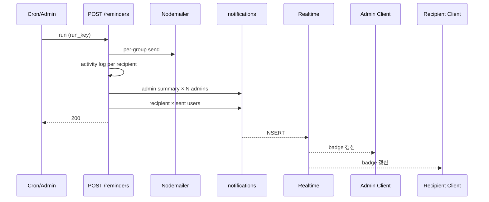

# 계약서 독촉 인앱 알림 기획서

> Date: 2026-07-18
> Status: Approved
> Author: planner
> **SQL:** `35` · `supabase/sql/35_notifications_contract_reminder_types.sql` (구현 시)
> **선행:** [08](./08_activity-audit-log-plan.md), [16](./16_contract-management-plan.md), [20](./20_contract-reminder-email-plan.md), [27](./27_in-app-notifications-user-update-plan.md)

## 선행 plan 참조 (Phase 0)

| Plan | 관계 |
|------|------|
| **08** | mutation Route 전 HTTP 분기 `recordActivityLog` · `x-request-id` — 본 plan에서 `reminders` route **누락분 보완** |
| **16** | `POST /api/contracts/reminders` · `contract.reminder_send` / `contract.reminder_failed` · 수신자별 activity log AC-19~20 |
| **20** | 독촉 run/recipient/unmatched · `/dashboard/system-email-logs` · full_name 매칭 — **fan-out 트리거 지점** |
| **27** | `notifications` 테이블 · Realtime · `fan-out.server.ts` · UI — **타입·CTA 확장** (plan 27 Out "contract 알림 후속" = 본 plan) |

**중복 금지:** 이메일·푸시·SMS Out. 독촉 로그 UI(`/dashboard/system-email-logs`) 변경 Out. Cron 스케줄 변경 Out (`sql/33` 평일 18:00 KST 유지).

---

## 한 줄 요약

계약서 첨부 누락 독촉 메일 run 종료 시 **모든 active admin**에게 run 요약 인앱 알림 1건을, SMTP **발송 성공(`sent`)** 수신자에게는 건수 요약 알림 1건을 fan-out한다. 동시에 `POST /api/contracts/reminders`에 plan 16/20이 요구하는 **activity log 전 분기**를 연동한다.

---

## 정책 확정안 (deep-interview)

| 항목 | 확정 |
|------|------|
| **Admin 알림 단위** | **run당 1건 요약** (수신자 N건이어도 admin 벨에는 1건) |
| **Admin 수신 범위** | **모든 active admin** (`profiles.system_role='admin'`, status active) — cron·수동 트리거 **동일** |
| **Admin 발송 시점** | run **종료 직후 항상** 1건 (sent 0건·unmatched만 있어도 알림) |
| **Admin 제목 분기** | 전부 성공 → `독촉 이메일 전송 완료` · 일부 실패 → `독촉 이메일 일부 전송 실패` · 전부 실패(groups>0, sent=0) → `독촉 이메일 전송 실패` · 발송 대상 0건(unmatched만) → `독촉 run 완료 (발송 대상 없음)` |
| **Admin 본문** | **건수 요약만** — `발송 성공 {sent}건 · 실패 {failed}건 · 미매칭 {unmatched}건` (문서번호 목록 **Out**) |
| **Admin CTA** | `발송 이력 보기` → `/dashboard/system-email-logs` |
| **수신자 알림 조건** | SMTP **`sent` 성공만** — `failed`·unmatched **알림 없음** |
| **수신자 본문** | **건수만** — `관리자가 계약서 독촉 이메일을 보냈습니다. 누락 계약서 {N}건 — 이메일을 확인해 주세요.` |
| **수신자 metadata** | `document_numbers` 배열 **allowlist** (body에는 미포함) |
| **수신자 CTA** | **없음** (카드 클릭 = 읽음만) |
| **중복 run** | 기존 `run_key` duplicate 응답 시 **알림 fan-out 없음** |
| **activity log** | `reminders/route.ts` **전 return 분기** + 수신자별 send/fail — plan 16/20 AC 충족 |
| **알림 INSERT log** | **Out** — `contract.reminder_send` activity log로 충분 (plan 27 원칙) |
| **fan-out 실패** | try/catch · **메일/run API 응답 불변** (plan 27 PUT 패턴) |

### 알림 타입 설계

단일 `contract.reminder` + metadata `role` 대신 **타입 2종** — CTA·템플릿·`getNotificationActions` 분기가 명확.

| `type` | 수신자 | CTA |
|--------|--------|-----|
| `contract.reminder_admin` | 각 active admin | `발송 이력 보기` |
| `contract.reminder_recipient` | profile 매칭 user (`sent`만) | 없음 |

---

## 제목·본문 템플릿 (한국어)

### Admin (`contract.reminder_admin`)

| run 상태 | `title` |
|----------|---------|
| `failedCount === 0` && `groups.length > 0` | `독촉 이메일 전송 완료` |
| `sentCount > 0` && `failedCount > 0` | `독촉 이메일 일부 전송 실패` |
| `sentCount === 0` && `groups.length > 0` | `독촉 이메일 전송 실패` |
| `groups.length === 0` && `unmatchedCount > 0` | `독촉 run 완료 (발송 대상 없음)` |
| `groups.length === 0` && `unmatchedCount === 0` | `[INFERRED]` 발생하지 않음 (400 no-targets) |

**body (공통):** `발송 성공 {sent_count}건 · 실패 {failed_count}건 · 미매칭 {unmatched_count}건`

**metadata allowlist:** `run_id`, `run_key`, `trigger_source` (`admin`|`cron`), `sent_count`, `failed_count`, `unmatched_count`, `run_status`, `kind: contract.reminder_admin`

### 수신자 (`contract.reminder_recipient`)

| 항목 | 문구 |
|------|------|
| **title** | `계약서 독촉 이메일 안내` |
| **body** | `관리자가 계약서 독촉 이메일을 보냈습니다. 누락 계약서 {document_count}건 — 이메일을 확인해 주세요.` |

**metadata allowlist:** `run_id`, `author_name`, `document_count`, `document_numbers` (배열), `kind: contract.reminder_recipient`

---

## 목표 & 완료 기준 (AC)

| # | 검증 | Given | When | Then |
|---|------|-------|------|------|
| AC-01 | API | 첨부 누락 계약·profile 매칭·SMTP 정상, admin A·B active | admin이 `POST /api/contracts/reminders` (고유 `run_key`) | HTTP 200 · **A·B 각각** `contract.reminder_admin` 알림 1건 · 제목 **「독촉 이메일 전송 완료」** · body 건수 요약 |
| AC-02 | API | AC-01과 동일 run, 수신자 user C (`sent`) | run 완료 직후 | C에게 `contract.reminder_recipient` 알림 1건 · body에 **건수** · metadata에 `document_numbers` |
| AC-03 | API | SMTP 일부 실패 (`partial_failed`) | run 완료 | 모든 admin 알림 제목 **「독촉 이메일 일부 전송 실패」** · body에 sent/failed 건수 |
| AC-04 | API | 모든 recipient `failed`, groups≥1 | run 완료 | 모든 admin 알림 제목 **「독촉 이메일 전송 실패」** |
| AC-05 | API | unmatched만 존재(groups=0) | run 완료 | 모든 admin 알림 제목 **「독촉 run 완료 (발송 대상 없음)」** · recipient 알림 **0건** |
| AC-06 | API | recipient SMTP `failed` | run 완료 | 해당 user **recipient 알림 없음** |
| AC-07 | API | 동일 `run_key`로 재호출(duplicate) | 2차 `POST` | HTTP 200 duplicate · **신규 admin/recipient 알림 없음** |
| AC-08 | API | cron secret으로 run (actor null) | run 성공 | 모든 active admin에게 admin 알림 1건씩 · metadata `trigger_source=cron` |
| AC-09 | Playwright | admin, AC-01 run 후 | admin `/dashboard/notifications` | admin 알림 카드 · CTA **「발송 이력 보기」** 클릭 → `/dashboard/system-email-logs` |
| AC-10 | Playwright | user C, AC-02 recipient 알림 | C `/dashboard/notifications` | 알림 카드 표시 · **CTA 버튼 없음** · 카드 클릭 시 읽음 처리 |
| AC-11 | Playwright | user C, AC-02 | C 헤더 벨 Popover | Realtime 또는 invalidate 후 unread badge **1+** · 제목 **「계약서 독촉 이메일 안내」** |
| AC-12 | API | 독촉 `sent` 1건 성공 | `GET /api/activity-logs?action=contract.reminder_send` | `request_id` 일치 행 · metadata `recipient_email`·`missing_document_numbers` |
| AC-13 | API | 독촉 recipient `failed` 1건 | activity logs 조회 | `contract.reminder_failed` 행 1건 · Status **2xx 또는 4xx/5xx에 맞는 분기** |
| AC-14 | API | `system_role=user` | `POST /api/contracts/reminders` | HTTP **403** · `contract.reminder_failed` 또는 auth failure log 1건 |
| AC-15 | API | cron secret 없음·비admin | `POST /api/contracts/reminders` | HTTP **401/403** · activity log 1건 · `x-request-id` 헤더 |
| AC-16 | API | 대상 계약 0건 | `POST /api/contracts/reminders` | HTTP **400** · `contract.reminder_failed` (또는 동등 실패 action) log · 알림 **없음** |
| AC-17 | grep/회귀 | plan 27 | admin이 user B `user.update` 알림 | 기존 AC **유지** · `contract.reminder_*` 타입이 `user.update` CTA에 영향 없음 |
| AC-18 | CLI | 구현 완료 | `bunx playwright test e2e/contract-reminder-notifications/` · tsc · lint · build | 통과 |

**회귀:** plan 20 system-email-logs UI · plan 27 notifications Realtime · 기존 `e2e/contract-reminder/reminders.api.spec.ts` AC-13(로그 없음 기대) → **AC-12로 대체·수정**.

---

## 범위 (In / Out)

### In Scope

| 순서 | 영역 | 내용 |
|------|------|------|
| A | **SQL `35`** | `notifications.type` CHECK에 `contract.reminder_admin` · `contract.reminder_recipient` 추가 |
| B | **BE group 확장** | `ContractReminderRecipientGroup.recipient_user_id` — 매칭 profile `user_id` |
| C | **BE fan-out** | `insertContractReminderAdminNotifications` · `insertContractReminderRecipientNotification` (`fan-out.server.ts`) |
| D | **BE route** | `reminders/route.ts` — send loop 내 activity log · run 종료 후 fan-out · duplicate 시 skip |
| E | **BE admin 조회** | active admin `user_id` 목록 helper (service_role) |
| F | **FE types** | `NotificationType` · `NotificationMetadata` 확장 |
| G | **FE helpers** | `notification-helpers.ts` — admin CTA · recipient 빈 actions |
| H | **검증** | `e2e/contract-reminder-notifications/` spec · API activity log · 기존 spec AC-13 수정 |

### Out of Scope

| 항목 | 비고 |
|------|------|
| 이메일·푸시·SMS | Out |
| `/dashboard/system-email-logs` UI 변경 | Out (CTA redirect만) |
| Cron 스케줄·`sql/33` 변경 | Out |
| 수동 독촉 발송 UI | Out (plan 20) |
| admin이 타인 contract 알림 읽음 처리 | Out (plan 27) |
| 알림 삭제·archived | Out |
| `notifications` INSERT activity log | Out |

---

## DB (`supabase/sql/35_notifications_contract_reminder_types.sql`)

```sql
-- Plan: 28_contract-reminder-notifications-plan.md
-- Date: 2026-07-18
-- Status: Approved

alter table public.notifications
  drop constraint if exists notifications_type_check;

alter table public.notifications
  add constraint notifications_type_check
  check (type in (
    'user.update',
    'contract.reminder_admin',
    'contract.reminder_recipient'
  ));
```

- plan 27 `sql/34` **amend** — Realtime publication·RLS **변경 없음**.
- 구현 시 `supabase/sql/` 최대 번호 재확인 후 `35` 유지 또는 +1.

---

## API / Service Layer

### Fan-out 위치

`POST /api/contracts/reminders` — `finishContractReminderRun` **성공 후**, HTTP 응답 **직전**:

```
for each recipient in loop:
  send email
  record recipient row
  recordActivityLog (sent → contract.reminder_send / failed → contract.reminder_failed)

finishContractReminderRun(...)

if NOT duplicate_run:
  try:
    fanOutContractReminderAdminNotifications({ run, counts, triggerSource })
    for each recipient where status === 'sent':
      fanOutContractReminderRecipientNotification({ group with user_id, runId })
  catch: server log only — 응답 불변

return JSON
```

### `listContractReminderRecipientGroups` 변경

매칭 profile 루프에서 group에 `recipient_user_id: profile.user_id` 추가. 동명이인 N명 → N groups (기존과 동일), 각각 고유 `user_id`.

### Admin 목록 helper

```ts
// service.server.ts 또는 fan-out.server.ts
listActiveAdminUserIds(): Promise<string[]>
// profiles where system_role='admin' AND status='active'
```

### Feature 구조 (확장)

```
src/features/notifications/api/
  fan-out.server.ts     — + insertContractReminderAdminNotifications
                        — + insertContractReminderRecipientNotification
  types.ts              — NotificationType 확장
src/features/contracts/api/
  types.ts              — ContractReminderRecipientGroup + recipient_user_id
  service.server.ts     — group 빌드 시 user_id 전달
src/app/api/contracts/reminders/route.ts
  — jsonWithActivityLog / finishWithActivityLog / logContractAuthFailure 패턴
```

### Read API

변경 **없음** — plan 27 `GET /api/notifications`가 신규 type을 그대로 반환.

---

## 활동 감사 로그

> `core-conventions.mdc` §활동 감사 로그 · [plan 08](./08_activity-audit-log-plan.md)

### 정책

| 구분 | 기록 |
|------|------|
| `POST /api/contracts/reminders` | **In** — 전 HTTP 분기 + 수신자별 send/fail |
| 알림 INSERT (fan-out) | **Out** |
| `GET /api/notifications` | **Out** (READ) |

### 기록 연동

| Route | action | return 분기 |
|-------|--------|-------------|
| `POST /api/contracts/reminders` | `contract.reminder_failed` | 401 invalid cron secret |
| `POST /api/contracts/reminders` | `contract.reminder_failed` | 403 non-admin (`logContractAuthFailure`) |
| `POST /api/contracts/reminders` | `contract.reminder_failed` | 400 JSON parse |
| `POST /api/contracts/reminders` | `contract.reminder_failed` | 400 no-targets |
| `POST /api/contracts/reminders` | `contract.reminder_send` | 200 duplicate_run (metadata `duplicate_run: true`) |
| `POST /api/contracts/reminders` | `contract.reminder_send` | 수신자별 `sent` (loop 내) |
| `POST /api/contracts/reminders` | `contract.reminder_failed` | 수신자별 `failed` (loop 내) |
| `POST /api/contracts/reminders` | `contract.reminder_failed` | 200/207 partial (run-level, **[INFERRED]** 수신자별 로그로 충분 시 생략 가능) |
| `POST /api/contracts/reminders` | `contract.reminder_failed` | 500 catch |

**actor:** cron → `reminderCronActor()` · admin → `actorFromProfile(session.profile)`

**target:** `target_type: contract` · `target_label: recipient_email` 또는 `run:{run_key}`

### metadata allowlist (기존 + 유지)

| key | 용도 |
|-----|------|
| `recipient_email` | 수신자 이메일 |
| `missing_document_numbers` | 독촉 문서번호 배열 |
| `unmatched_count` | 미매칭 건수 |
| `duplicate_run` | 중복 run_key |
| `error_code` / `message` | 실패 분기 |

---

## UI 요구사항 (designer / FE)

### 변경 최소 (plan 27 구조 유지)

| 항목 | 내용 |
|------|------|
| **notification-helpers** | `contract.reminder_admin` → CTA `발송 이력 보기` / `contract.reminder_recipient` → `[]` |
| **NOTIFICATION_ACTION_ROUTES** | `view-system-email-logs` → `/dashboard/system-email-logs` |
| **카드** | 기존 `NotificationCard` 재사용 — 타입별 title/body는 API 저장값 그대로 표시 |
| **Realtime** | 변경 없음 — INSERT invalidate로 신규 type 자동 반영 |
| **로딩** | 변경 없음 |

### designer 참고

- admin·recipient 알림 **동일 카드 컴포넌트**
- recipient는 CTA 영역 **비표시** (actions 빈 배열)

---

## 영향 파일 & 패턴

| 파일 | 변경 |
|------|------|
| `supabase/sql/35_notifications_contract_reminder_types.sql` | **신규** — type CHECK 확장 |
| `src/features/contracts/api/types.ts` | `recipient_user_id` on group |
| `src/features/contracts/api/service.server.ts` | group 빌드에 `user_id` |
| `src/features/notifications/api/fan-out.server.ts` | contract reminder fan-out 2함수 |
| `src/features/notifications/api/types.ts` | `NotificationType` · metadata |
| `src/features/notifications/components/notification-helpers.ts` | CTA 분기 |
| `src/app/api/contracts/reminders/route.ts` | activity log + fan-out |
| `e2e/contract-reminder-notifications/*.spec.ts` | **신규** |
| `e2e/contract-reminder/reminders.api.spec.ts` | AC-13 기대값 수정 (로그 **있음**) |

**패턴:** plan 27 `insertUserUpdateNotification` · plan 08 `jsonWithActivityLog` · contracts `_utils` `logContractAuthFailure` · `reminderCronActor`

---

## 리스크 & 완화

| # | 등급 | 리스크 | 완화 |
|---|------|--------|------|
| 1 | HIGH | fan-out 실패가 run API 500 유발 | try/catch · 응답 불변 (AC 회귀 없음) |
| 2 | HIGH | activity log 누락 분기 | plan 16 매트릭스·AC-12~16 API 검증 |
| 3 | MED | admin N명 × run마다 N건 알림 | 사용자 확정 — run당 1건/admin 의도적 |
| 4 | MED | `recipient_user_id` 누락 시 fan-out skip | group 빌드 시 profile.user_id 필수 · 단위 검증 |
| 5 | MED | duplicate run에 알림 중복 | early return **fan-out 호출 전** |
| 6 | LOW | e2e AC-13 역기대 | spec 수정을 plan AC에 명시 |

---

## 구현 순서

| # | 단계 | 산출 |
|---|------|------|
| 1 | SQL `35` apply | type CHECK 확장 |
| 2 | `ContractReminderRecipientGroup` + `listContractReminderRecipientGroups` | `recipient_user_id` |
| 3 | `fan-out.server.ts` + `listActiveAdminUserIds` | insert 함수 |
| 4 | `reminders/route.ts` activity log (전 분기 + loop) | plan 16/20 충족 |
| 5 | `reminders/route.ts` fan-out (run 종료 후) | admin + recipient 알림 |
| 6 | FE `types.ts` + `notification-helpers.ts` | CTA |
| 7 | E2E `e2e/contract-reminder-notifications/` + 기존 spec 수정 | AC green |
| 8 | tsc · lint · build | verifier |

**Checkpoint:** Step 4 완료 후 API로 `contract.reminder_send` log 확인 → Step 5에서 알림 INSERT 수동 검증.

---

## 추정

| 항목 | 값 |
|------|-----|
| 복잡도 | **Medium** |
| SQL | 1 파일 |
| BE | route + fan-out + group 확장 |
| FE | types + helpers (~30 LOC) |
| E2E | 신규 spec 2~3 파일 |
| 예상 시간 | **~2.5–4시간** |

---

## E2E spec 구조 (verifier용)

```txt
e2e/contract-reminder-notifications/
  admin-run-summary.spec.ts    — AC-01, 03~05, 09 (admin 알림·제목 분기·CTA)
  recipient-sent-only.spec.ts — AC-02, 06, 10, 11 (수신자·no CTA·failed skip)
  reminders-log-and-duplicate.spec.ts — AC-07, 08, 12~16 (activity log·duplicate·cron)
```

셀렉터: `getByRole` · `getByTestId` only.

---

## requirements-pipeline Express (Phase 3)

### 가정

| ID | 가정 |
|----|------|
| A1 | plan 27 `notifications`·Realtime **원격 적용 완료** |
| A2 | plan 20 독촉 run/recipient **동작 중** |
| A3 | admin 알림은 **운영 가시성** — 이메일 발송과 독립적 fan-out |
| A4 | 수신자 알림은 **이메일 수신 확인 유도** — WakeOne 내부 deep link 불필요 |

### 핵심 시퀀스



---

## 수정 이력

| 날짜 | 변경 내용 | 작성자 |
|------|----------|--------|
| 2026-07-18 | 최초 작성 · deep-interview 확정 · Status Approved | planner |
