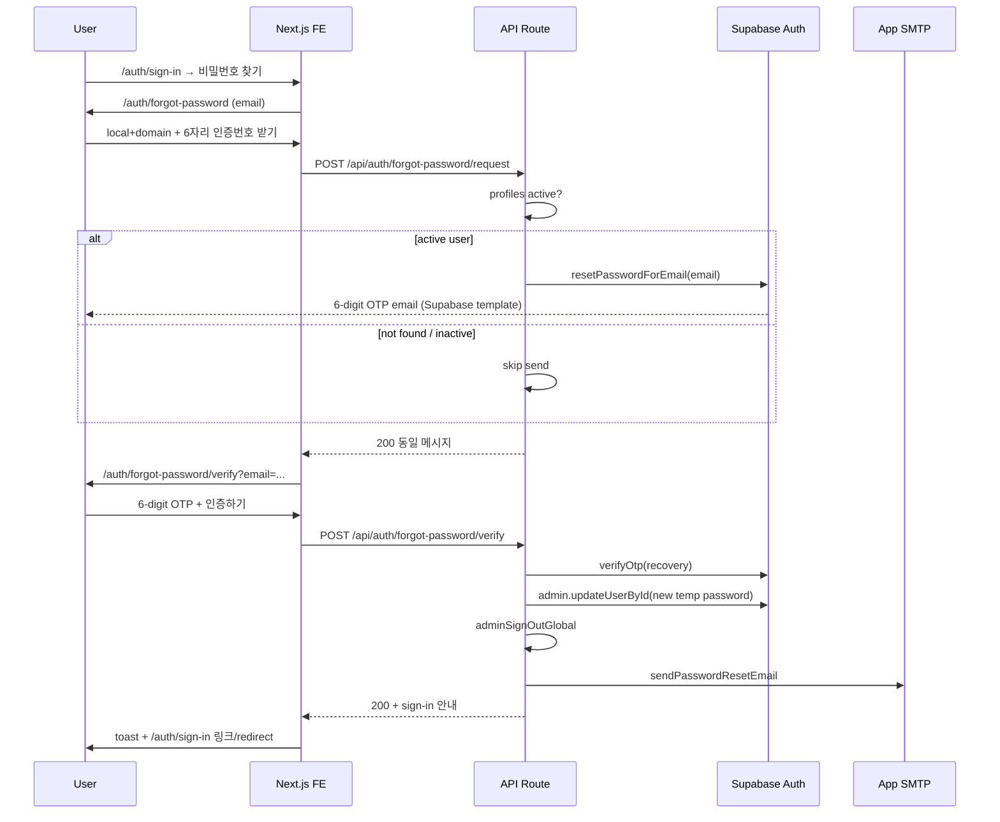

# 비밀번호 찾기 (Password Reset OTP) 기획서

> Date: 2026-08-07  
> Status: In Progress  
> Author: planner  
> **SQL:** 해당 없음  
> **선행:** [01](./01_supabase-auth-login-plan.md), [02](./02_user-invite-profiles-plan.md), [08](./08_activity-audit-log-plan.md), [11](./11_password-policy-set-password-removal-plan.md), [34](./34_login-email-split-ux-plan.md)

## 선행 plan 참조 (Phase 0)

| Plan | 관계 |
|------|------|
| **01** | **확장** — `/auth/*` 미로그인 허용·로그인 시 dashboard redirect 유지. sign-in 링크에서 forgot-password 진입 |
| **02** | **재사용** — `invite.server.ts`·`send-invite-email.ts`·`generateTemporaryPassword`·SMTP 패턴 |
| **07** | **수정** — `middleware.ts` forgot-password **공개 API** allowlist 추가 (현재 `/api/*` 전부 401) |
| **08** | **필수** — mutation Route 전 분기 `recordActivityLog` · `x-request-id` |
| **11** | **정합** — 임시 비밀번호 8자+문자·숫자 (`generateTemporaryPassword`) · set-password 경로 없음 |
| **34** | **재사용** — sign-in과 동일 `LoginDomainCombobox`·로컬+도메인 조합·preset |
| **profile.password_change** | **동일 패턴** — `adminSignOutGlobal` · activity log Route 구조 참조 (`/api/profile/password`) |

**중복 금지:** Resend OTP · Contact support footer · magic link 클릭 플로우 · self-service sign-up · 비밀번호 변경 Sheet(`profile.password_change`) 수정 **Out**.

---

## 한 줄 요약

로그인 페이지에서 **비밀번호 찾기**로 진입해 이메일(로컬+도메인) 입력 → Supabase **6자리 recovery OTP** 발송 → OTP 검증 후 서버가 **10자리 임시 비밀번호**로 교체·**전역 로그아웃**·SMTP 안내 메일 발송 → **로그인 페이지**로 안내한다. 미등록·inactive 이메일은 **동일 성공 메시지**(열거 방지).

---

## 목표 & 완료 기준

- 미로그인 사용자가 sign-in → forgot-password → verify → sign-in **End-to-end** (한국어 UI)
- **active** `profiles`만 Supabase OTP 메일 발송; 미등록·inactive는 **메일 미발송**·응답 동일
- OTP 검증 성공 시 `admin.updateUserById` + `adminSignOutGlobal` + `sendPasswordResetEmail`
- mutation Route 2건 **전 HTTP 분기** activity log + E2E/API 검증
- Playwright UI spec green · activity log API spec green · tsc · lint · build 통과

---

## 범위 (In / Out)

### In Scope

| # | 영역 | 내용 |
|---|------|------|
| 1 | **FE — sign-in** | `sign-in-view.tsx` 「비밀번호 찾기」 Link → `/auth/forgot-password` |
| 2 | **FE — email step** | `/auth/forgot-password` · plan 34 이메일 UI 재사용 · CTA 「6자리 인증번호 받기」 |
| 3 | **FE — verify step** | `/auth/forgot-password/verify` · 6자리 `InputOTP` (3-3 dash) · CTA 「인증하기」 |
| 4 | **FE — feature layer** | `src/features/auth/api/forgot-password/` · `mutations.ts` · schemas · views/forms |
| 5 | **BE — request** | `POST /api/auth/forgot-password/request` · profile active 검사 · `resetPasswordForEmail` |
| 6 | **BE — verify** | `POST /api/auth/forgot-password/verify` · `verifyOtp(type:'recovery')` · 임시 PW·로그아웃·메일 |
| 7 | **BE — mail** | `src/lib/mail/send-password-reset-email.ts` (invite 메일 HTML 패턴) |
| 8 | **BE — middleware** | forgot-password API **공개** allowlist |
| 9 | **BE — activity log** | `auth.password_reset_request` · `auth.password_reset_complete` · labels/types 확장 |
| 10 | **designer** | desktop+mobile 목업 (email·verify 카드) |

### Out of Scope

| 항목 | 비고 |
|------|------|
| SQL · RLS · `profiles` 스키마 변경 | Out — 기존 `email`·`status` 조회만 |
| Resend Code · 「I no longer have access…」 · Contact support footer | **명시 제외** |
| Magic link 클릭만으로 비밀번호 변경 | Out — OTP 입력 필수 |
| 로그인 후 `ProfilePasswordSheet` 변경 | Out — 기존 유지 |
| OTP 재발송 rate limit UI | Out (Supabase 기본 throttle에 의존) |
| Supabase Auth 이메일 템플릿 편집 | Out — 사용자가 `{{ .Token }}` 설정 **완료** 가정 |
| CI에서 실제 SMTP·실제 OTP 메일 수신 검증 | Out — API/UI mock·분기 검증만 |
| **verifier (Playwright · tsc · lint · build)** | **Out** — 개발자 수동 QA (2026-08-07 사용자 지시) |
| **E2E spec 파일** (`e2e/auth/forgot-password-*.spec.ts`) | **Out** — verifier 제외에 따라 미작성 |
| activity log UI에 anonymous actor 필터 UX 개선 | Out |

---

## 사용자 플로우 (확정)

---

## UI 요구사항

### 공통

- **언어:** 한국어
- **레이아웃:** sign-in과 동일 2-column shell (`sign-in-view` 패턴) — designer 목업에서 좌측 브랜딩·우측 카드
- **로딩:** 각 route `loading.tsx` 또는 `Suspense` + `PageLoadingSpinner variant="default"`
- **아이콘:** `Icons.*` only
- **폼:** `useAppForm` + `useFormFields` · 성공 시 `form.reset()` · 취소 시 reset 금지

### Step 1 — `/auth/forgot-password` (이메일)

| 요소 | copy / 동작 |
|------|-------------|
| **제목** | 「비밀번호 찾기」 |
| **안내** | 「가입한 이메일을 입력하면 6자리 인증번호를 보내 드립니다.」 |
| **이메일** | plan 34 — 로컬 Input + `@` + `LoginDomainCombobox` · `data-testid="login-domain-combobox"` 재사용 |
| **CTA** | `getByRole('button', { name: '6자리 인증번호 받기' })` |
| **보조 링크** | 「로그인으로 돌아가기」 → `/auth/sign-in` |
| **성공** | toast 「등록된 이메일이면 인증 코드를 보냈습니다.」 · navigate `/auth/forgot-password/verify?email={encoded}` (nuqs `searchParamsCache` 서버 · `useQueryStates` 클라) |
| **검증 실패** | 로컬 비움·조합 email invalid → 필드/폼 에러 · **동일 열거 방지 메시지로 대체하지 않음** (입력 검증만) |

### Step 2 — `/auth/forgot-password/verify` (OTP)

| 요소 | copy / 동작 |
|------|-------------|
| **제목** | 「인증번호 확인」 (참조 UI "Verify your login" 카드 — **한국어**) |
| **안내** | 「{email}로 보낸 6자리 인증번호를 입력해 주세요.」 — email은 query에서 · monospace 아님 |
| **OTP** | `InputOTP` maxLength=6 · `InputOTPGroup` 2그룹(3+3) · 중간 `InputOTPSeparator` (dash) · `data-testid="forgot-password-otp-input"` |
| **CTA** | `getByRole('button', { name: '인증하기' })` |
| **제외 UI** | Resend · 「I no longer have access…」 · Contact support footer **렌더 금지** |
| **성공** | toast 「임시 비밀번호를 이메일로 보냈습니다. 로그인해 주세요.」 · `/auth/sign-in` 이동 (Link 또는 `router.push`) |
| **실패** | 「인증번호가 올바르지 않거나 만료되었습니다.」 (generic) · OTP 필드 유지(reset 금지) |

### sign-in 링크

- `sign-in-view.tsx` 폼 하단(또는 비밀번호 필드 근처) · `Link href="/auth/forgot-password"` · copy 「비밀번호 찾기」 · `getByRole('link', { name: '비밀번호 찾기' })`

### Designer UI 미리보기 (필수)

| # | 산출 | 내용 |
|---|------|------|
| **D1** | Desktop — email step | 제목·안내·로컬+@+Combobox·「6자리 인증번호 받기」·로그인 돌아가기 |
| **D2** | Desktop — verify step | 제목·이메일 안내·OTP 3-3·「인증하기」 only (Resend/support **없음**) |
| **D3** | Mobile ~390px — email | #D1 동일 정보 구조 |
| **D4** | Mobile ~390px — verify | #D2 동일 정보 구조 |

---

## API / DB 요구사항

### SQL

**해당 없음** — `profiles`·`auth.users` 기존 컬럼만 사용.

### middleware (필수)

`middleware.ts` — `isPublicAuthApiPath` (명칭 FE/BE 협의) 추가:

| Path | 이유 |
|------|------|
| `POST /api/auth/forgot-password/request` | 미로그인 |
| `POST /api/auth/forgot-password/verify` | 미로그인 |

현재 `isApiPath && !isServiceTokenApiPath` → 무조건 401 이므로 **반드시** 예외 처리.

`/auth/forgot-password*` — plan 01과 동일: **로그인 상태**면 `/dashboard/overview` redirect.

### POST `/api/auth/forgot-password/request`

**Body:** `{ email: string }` — 서버 `normalizeEmail`

**로직:**

1. Zod: non-empty + email format → 400 + log
2. `profiles` lookup (service role): `email` ilike + `status`
3. **active** (`status === 'active'`): anon/publishable client `auth.resetPasswordForEmail(email, { redirectTo: `${APP_URL}/auth/forgot-password/verify` })` — redirectTo는 Supabase 설정용; **실제 UX는 OTP 입력**
4. **not found / inactive:** reset **호출 안 함**
5. **항상** `200` `{ success: true, message: '등록된 이메일이면 인증 코드를 보냈습니다.' }` (열거 방지)
6. Supabase send **실패**(active user): `500` + log (`internal_error`) — **클라이언트 메시지는 generic** 「요청 처리에 실패했습니다. 잠시 후 다시 시도해 주세요.」(열거 방지 유지 vs 운영 — **500만 generic**, 200은 항상 동일)

**인증:** 없음 · `actor_user_id = null` · `actor_email = 'anonymous'`

### POST `/api/auth/forgot-password/verify`

**Body:** `{ email: string, token: string }` — token exactly 6 digits

**로직:**

1. Validation fail → 400 + log
2. Publishable client (no persist session): `verifyOtp({ email, token, type: 'recovery' })`
3. OTP fail → 400 + log (`error_code: validation` 또는 신규 `invalid_otp`)
4. Success → resolve `user_id` from OTP session/user
5. `temporaryPassword = generateTemporaryPassword(10)`
6. `admin.auth.admin.updateUserById(userId, { password: temporaryPassword })`
7. `adminSignOutGlobal(userId)` — plan profile.password_change 동일
8. `profiles.update({ password_set_at: now })` where user_id (invite와 정합)
9. `sendPasswordResetEmail({ to, temporaryPassword, signInUrl })` — 실패 시 500 + log (비밀번호는 이미 변경됨 — metadata에 `mail_sent: false` **금지** 민감; `error_code: internal_error` only)
10. verifyOtp로 생성된 **클라이언트 세션 폐기** (signOut on ephemeral client) — 사용자는 **로그인 안 된 상태**
11. `200` `{ success: true, message: '임시 비밀번호를 이메일로 보냈습니다. 로그인해 주세요.' }`

**인증:** 없음 · target = 해당 user

---

## 활동 감사 로그 (CUD · 필수)

> `core-conventions.mdc` · [plan 08](./08_activity-audit-log-plan.md)

### action 코드 (신규)

| action | HTTP | Path | actor | target |
|--------|------|------|-------|--------|
| `auth.password_reset_request` | POST | `/api/auth/forgot-password/request` | anonymous | `profiles.user_id` (active 시) 또는 null + `attempted_target` email |
| `auth.password_reset_complete` | POST | `/api/auth/forgot-password/verify` | anonymous | 대상 `user_id` · `target_label` = email |

### 타입 확장

| 파일 | 변경 |
|------|------|
| `src/features/activity-logs/api/types.ts` | `ActivityAction` +2 · `ActivityTargetType` + `'auth'` (또는 `'profile'` 재사용 — **implementer: `auth` 추가 권장**) |
| `src/features/activity-logs/labels.ts` | 한국어 라벨 2건 |
| `ActivityLogErrorCode` | `invalid_otp` optional |

### 기록 연동 매트릭스

#### `POST /api/auth/forgot-password/request`

| 분기 | HTTP | metadata |
|------|------|----------|
| body validation fail | 400 | `validation` |
| active + resetPasswordForEmail ok | 200 | `{}` 또는 `{ recipient_email: normalized }` — **OTP·임시비밀번호 금지** |
| not found / inactive (no send) | 200 | `{ attempted_target: email }` |
| resetPasswordForEmail error | 500 | `internal_error` |
| uncaught | 500 | `internal_error` |

#### `POST /api/auth/forgot-password/verify`

| 분기 | HTTP | metadata |
|------|------|----------|
| body validation fail | 400 | `validation` |
| verifyOtp fail | 400 | `invalid_otp` (또는 `validation`) |
| updateUser / signOut / mail fail | 500 | `internal_error` |
| success | 200 | `{}` — **temporary_password 값 metadata 금지** |
| uncaught | 500 | `internal_error` |

**공통:** Handler 진입 `requestId = crypto.randomUUID()` · 각 `return` 직전 `recordActivityLog` · 응답 `x-request-id`.

---

## 영향 파일 (예상)

### 신규

| 경로 | 이유 |
|------|------|
| `src/app/auth/forgot-password/page.tsx` | email step RSC |
| `src/app/auth/forgot-password/verify/page.tsx` | verify step RSC |
| `src/app/auth/forgot-password/loading.tsx` | 로딩 UI |
| `src/app/auth/forgot-password/verify/loading.tsx` | 로딩 UI |
| `src/app/api/auth/forgot-password/request/route.ts` | request mutation |
| `src/app/api/auth/forgot-password/verify/route.ts` | verify mutation |
| `src/features/auth/components/forgot-password-email-view.tsx` | email shell |
| `src/features/auth/components/forgot-password-verify-view.tsx` | verify shell |
| `src/features/auth/components/forgot-password-email-form.tsx` | email form |
| `src/features/auth/components/forgot-password-verify-form.tsx` | OTP form |
| `src/features/auth/schemas/forgot-password-email-form.ts` | Zod |
| `src/features/auth/schemas/forgot-password-verify-form.ts` | Zod (6 digit) |
| `src/features/auth/api/forgot-password/types.ts` | API contracts |
| `src/features/auth/api/forgot-password/service.ts` | fetch wrappers |
| `src/features/auth/api/forgot-password/mutations.ts` | `onSettled` invalidate N/A (auth keys minimal) |
| `src/lib/mail/send-password-reset-email.ts` | SMTP 안내 |
| `e2e/auth/forgot-password-flow.spec.ts` | UI E2E |
| `e2e/auth/forgot-password.api.spec.ts` | activity log API |

### 수정

| 경로 | 이유 |
|------|------|
| `src/features/auth/components/sign-in-view.tsx` | 비밀번호 찾기 Link |
| `middleware.ts` | public auth API allowlist |
| `src/features/activity-logs/api/types.ts` | action·target·error_code |
| `src/features/activity-logs/labels.ts` | ACTION_LABELS |

### 재사용 (변경 최소)

| 경로 | 비고 |
|------|------|
| `src/features/auth/components/login-domain-combobox.tsx` | plan 34 |
| `src/features/auth/constants/login-domain-options.ts` | preset |
| `src/lib/auth/temp-password.ts` | `generateTemporaryPassword(10)` |
| `src/lib/auth/admin-auth.ts` | `adminSignOutGlobal` |
| `src/lib/mail/send-invite-email.ts` | HTML·SMTP 패턴 참조 |
| `src/components/ui/input-otp.tsx` | OTP UI |

---

## E2E spec 범위

**판정:** `bunx playwright test` only · **셀렉터:** `getByRole` · `getByPlaceholder` · `getByTestId` only

### `e2e/auth/forgot-password-flow.spec.ts` (UI)

**인증:** `storageState` **미사용** (미로그인)

| # | 시나리오 |
|---|----------|
| F1 | sign-in → 「비밀번호 찾기」→ `/auth/forgot-password` |
| F2 | email step — heading·Combobox·CTA visible |
| F3 | 로컬 비움 → CTA → 필수 에러 · URL 유지 |
| F4 | valid 형식 email → CTA → toast **동일 메시지** · `/auth/forgot-password/verify` + email query |
| F5 | verify step — OTP input·「인증하기」·Resend/support **absent** |
| F6 | OTP 5자리 → submit → validation 에러 |
| F7 | verify URL에 email 없음 → email step redirect 또는 에러 안내 (implementer: **redirect `/auth/forgot-password`**) |

**실제 OTP 성공(E2E F8):** CI 불가 — **skip** 또는 `@slow` + env `E2E_PASSWORD_RESET_OTP` 있을 때만 optional. plan AC는 API spec으로 cover.

### `e2e/auth/forgot-password.api.spec.ts` (activity log)

| # | 시나리오 |
|---|----------|
| A1 | POST request invalid body → 400 · `x-request-id` · log `auth.password_reset_request` · status 400 |
| A2 | POST request unknown email → 200 · log 200 · metadata `attempted_target` |
| A3 | POST verify invalid token → 400 · log `auth.password_reset_complete` · 400 |
| A4 | (optional) staging secret + known OTP fixture → 200 · log 200 — **env 없으면 skip** |

**조회:** admin `storageState` · `GET /api/activity-logs?action=auth.password_reset_*` · `request_id` match (pattern: `e2e/users/add-flow.api.spec.ts`)

---

## Acceptance Criteria (Given-When-Then)

### 기능 AC — UI

| # | Given | When | Then |
|---|-------|------|------|
| 1 | 미로그인 · `/auth/sign-in` | 페이지 로드 | `getByRole('link', { name: '비밀번호 찾기' })` visible |
| 2 | AC-1 | 「비밀번호 찾기」 클릭 | URL `/auth/forgot-password` · heading 「비밀번호 찾기」 |
| 3 | `/auth/forgot-password` | 로드 완료 | 안내 문구 · 로컬 Input · `getByTestId('login-domain-combobox')` · `getByRole('button', { name: '6자리 인증번호 받기' })` |
| 4 | AC-3 · 로컬 비움 | 「6자리 인증번호 받기」 클릭 | 이메일 필수 에러 · URL `/auth/forgot-password` 유지 |
| 5 | AC-3 · valid local+domain | 「6자리 인증번호 받기」 클릭 | toast 「등록된 이메일이면 인증 코드를 보냈습니다.」 · URL `/auth/forgot-password/verify` · query에 email |
| 6 | AC-5와 **동일 payload** · DB에 **없는** email | 「6자리 인증번호 받기」 클릭 | toast **동일** (AC-5와 같은 문구) · verify URL 이동 (**열거 방지**) |
| 7 | `/auth/forgot-password/verify?email=user@wakecorp.com` | 로드 | heading 「인증번호 확인」 · `getByTestId('forgot-password-otp-input')` · 「인증하기」 · **Resend/support 텍스트 없음** |
| 8 | AC-7 · OTP `12345` (5자) | 「인증하기」 클릭 | validation 에러 · `/auth/sign-in` redirect **없음** |
| 9 | AC-7 · wrong OTP `000000` | 「인증하기」 클릭 | 「인증번호가 올바르지 않거나 만료되었습니다.」(또는 동등 generic) · sign-in redirect **없음** |
| 10 | (manual/staging) valid OTP · active user | 「인증하기」 성공 | toast 임시 비밀번호 안내 · `/auth/sign-in` · 새 임시 PW로 로그인 가능 |
| 11 | 로그인 상태 | `/auth/forgot-password` 직접 접근 | `/dashboard/overview` redirect (plan 01) |

### Designer AC

| # | Given | When | Then |
|---|-------|------|------|
| D1 | designer 산출 | desktop email 목업 | 제목·안내·email 필드·CTA·로그인 링크 |
| D2 | designer 산출 | desktop verify 목업 | OTP 3-3·인증하기 only |
| D3 | designer 산출 | mobile email ~390px | #D1 구조 |
| D4 | designer 산출 | mobile verify ~390px | #D2 구조 |

### Activity log AC (API)

| # | Given | When | Then |
|---|-------|------|------|
| 12 | — | POST request invalid `{}` | 400 · header `x-request-id` · log action `auth.password_reset_request` · http_status 400 |
| 13 | — | POST request `{ email: 'unknown@example.com' }` | 200 · log 200 · metadata `attempted_target` |
| 14 | — | POST verify `{ email, token: '000000' }` | 400 · log `auth.password_reset_complete` · 400 · `invalid_otp` or `validation` in metadata |
| 15 | admin session | GET `/api/activity-logs?action=auth.password_reset_request&limit=20` | AC-12·13 request_id 행 존재 |

### CLI / 회귀

| # | Given | When | Then |
|---|-------|------|------|
| 16 | spec 작성 완료 | `bunx playwright test e2e/auth/forgot-password-flow.spec.ts e2e/auth/forgot-password.api.spec.ts` | **green** (optional tests skipped OK) |
| 17 | — | `bunx tsc --noEmit` · lint · build | **통과** |
| 18 | plan 34 구현 존재 | sign-in email split spec | **green** (회귀) |

---

## 리스크 & 완화

| # | 등급 | 리스크 | 완화 |
|---|------|--------|------|
| 1 | **HIGH** | middleware가 forgot-password API 401 | plan §middleware allowlist · AC-12 |
| 2 | **HIGH** | verifyOtp 후 세션 잔존 → 자동 로그인 | ephemeral client signOut · adminSignOutGlobal · AC-10 |
| 3 | **HIGH** | metadata에 OTP·임시비밀번호 유출 | allowlist review · log.server sanitizer |
| 4 | MED | inactive user에 OTP 발송 | request Route status check · no send |
| 5 | MED | 메일 성공/비밀번호 변경 partial failure | log 500 · ops 재발송 runbook (Out of auto retry) |
| 6 | MED | CI real OTP 불가 | API spec 분기 검증 · F8 optional/skip |
| 7 | LOW | verify page email query tampering | server verify email+token only · no trust client-only |

---

## 열린 질문

- [TBD] verify 실패 generic copy 최종 — designer·FE 협의 (AC-9 baseline 확정)
- [TBD] `ActivityTargetType` `'auth'` vs `'profile'` — **권장 `'auth'`** (implementer 확정)

---

## 수정 이력

| 날짜 | 변경 내용 | 작성자 |
|------|----------|--------|
| 2026-08-07 | 최초 작성 · deep-interview 확정 · Status Approved | planner |
| 2026-08-07 | verifier/E2E Out · 수동 QA · Status In Progress | root |
| 2026-08-07 | designer·BE·FE 구현 완료 · tsc 통과 · 수동 QA 대기 | root |
