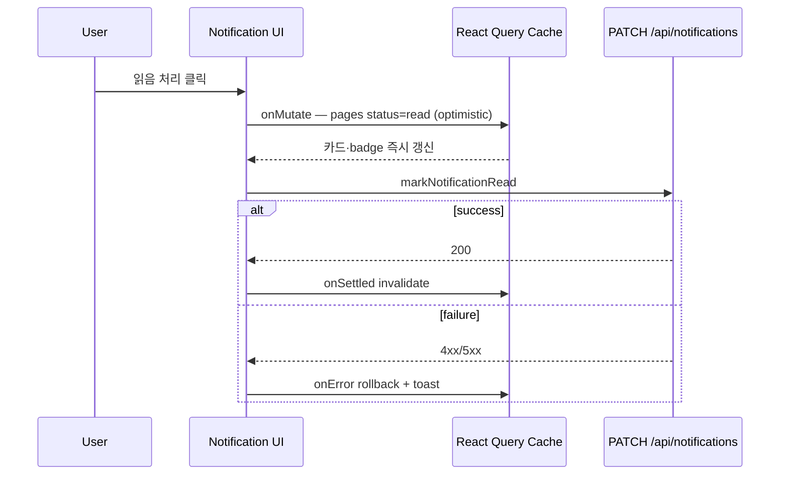

# 알림 읽음 Optimistic Update 기획서

> Date: 2026-08-07  
> Status: Completed  
> Author: planner  
> **SQL:** 해당 없음  
> **선행:** [04](./04_user-reactivate-plan.md), [08](./08_activity-audit-log-plan.md), [27](./27_in-app-notifications-user-update-plan.md)

## 선행 plan 참조 (Phase 0)

| Plan | 관계 |
|------|------|
| **27** | **직접 확장** — `markNotificationRead` / `markAllNotificationsRead` mutation·infinite scroll·AC #5·#6·Realtime INSERT invalidate. 이번 plan은 **FE React Query cache layer**만 개선 (optimistic update) |
| **08** | `notification.read` / `notification.read_all` action **기존 유지** — Route·로그 변경 **Out** |
| **04** | Users mutation `onSettled` invalidate 패턴 참조 — 이번엔 **onMutate + onError rollback** 추가 |

**중복 금지:** BE PATCH Route·activity log action·SQL·Realtime 로직 **재구현 Out**. plan 27 AC #5·#6 **회귀** + UI 즉시 assertion **추가**.

---

## 한 줄 요약

인앱 알림 **단건 읽음**·**모두 읽음** mutation에 React Query **optimistic update**를 도입해 invalidate refetch 대기 없이 카드·벨 badge·탭 카운트가 즉시 갱신되며, PATCH 실패 시 rollback + error toast로 복구한다.

---

## 정책 확정안 (deep-interview · battle-plan)

| 항목 | 확정 |
|------|------|
| **대상 mutation** | `markNotificationRead` · `markAllNotificationsRead` |
| **캐시 전략** | `notificationKeys.all` prefix로 **모든 list infinite query variant 일괄 patch** + `onSettled` invalidate **유지** |
| **실패 UX** | `onError` rollback + `notifyError` toast — 단건: `알림 읽음 처리에 실패했습니다.` · 모두: `모두 읽음 처리에 실패했습니다.` |
| **toast 위치** | `mutations.ts` 중앙 (`onError`) |
| **Realtime race** | **허용** — `NotificationsRealtime` 로직 변경 **Out** |
| **E2E** | UI **즉시** assertion 추가 + API poll **회귀용 유지** |
| **E2E 제약** | **`e2e/notifications/`만** 수정·실행 — contract reminder·`e2e/contracts` 등 **호출·시드·cleanup·의존 금지** |
| **activity log** | **해당 없음** — 기존 PATCH Route·action 유지 |

---

## 목표 & 완료 기준 (AC)

| # | 검증 | Given | When | Then |
|---|------|-------|------|------|
| 1 | Playwright | user B, `/dashboard/notifications`에 unread 알림 1건+ | 해당 카드 **읽음 처리** 버튼 클릭 | **즉시**(API poll 전) 해당 카드에서 **읽음 처리** 버튼 **미표시** · unread dot·배경 스타일 해제 |
| 2 | Playwright | user B, overview 벨 badge에 숫자 표시 | AC #1과 동일 클릭 | **즉시** 벨 badge **감소 또는 0** (API poll 전) |
| 3 | Playwright | user B, unread 알림 2건+ | `/dashboard/notifications` **모두 읽음** 클릭 | **즉시** **모두 읽음** 버튼 **사라짐** · **읽지 않음** 탭 카운트 **0** |
| 4 | Playwright | AC #3 직후 | overview `/dashboard/overview` 진입 | **즉시** 벨 badge **0** (API poll 전) |
| 5 | Playwright/API | AC #1 직후 | — | API poll: 해당 알림 `status=read` (plan 27 AC #5 **회귀**) |
| 6 | Playwright/API | AC #3 직후 | — | API poll: unread **0** (plan 27 AC #6 **회귀**) |
| 7 | Manual | dev 환경에서 PATCH 403/500 유도 | mutation 실패 | UI **rollback** · 단건/모두 **별도** error toast |
| 8 | CLI | 구현 완료 후 | `bunx playwright test e2e/notifications/` · `npx tsc --noEmit` · `npm run lint:strict` · `npm run build` | 모두 통과 |

**회귀:** plan 27 AC #17·#18 (activity log API) — AC #5·#6 API poll 경로로 **간접 회귀**. plan 27 admin viewer·infinite scroll AC **유지**.

---

## 범위 (In / Out)

### In Scope (구현 순서: **FE helper → mutations → E2E → 검증**)

| 순서 | 영역 | 내용 |
|------|------|------|
| A | **FE helper** | `src/features/notifications/api/optimistic.ts` — infinite query pages patch · snapshot · restore |
| B | **FE mutations** | `mutations.ts` — `onMutate` / `onError` / `onSettled`(invalidate 유지) |
| C | **FE (확인)** | Popover·페이지 badge/탭 — 캐시 파생값만 사용, 컴포넌트 변경 **최소** |
| D | **E2E** | `e2e/notifications/notifications-page.spec.ts` — AC #1–#6 UI 즉시 + API poll |
| E | **검증** | AC #8 CLI |

### Out of Scope

| 항목 | 비고 |
|------|------|
| BE Route / SQL / activity log 변경 | Out — 기존 PATCH·`notification.read` / `notification.read_all` 유지 |
| `NotificationsRealtime` 로직 변경 | Out — INSERT race **허용** |
| admin 타인 알림 읽음 처리 | Out (plan 27과 동일) |
| 신규 알림 INSERT optimistic | Out |
| DELETE UI / `AlertModal` | 해당 없음 |
| **contract 관련 E2E·시드·cleanup** | Out — `e2e/contracts`·contract reminder API·Cron **호출·의존·수정 금지** |
| AC #7 Playwright 자동화 | Out — **Manual** 검증 |
| designer UI 변경 | Out — 카드·Popover 구조·카피 변경 없음 |

---

## API / DB 요구사항

**변경 없음.** 기존 Route 유지:

| Route | 용도 |
|-------|------|
| `PATCH /api/notifications/[id]/read` | 단건 읽음 |
| `PATCH /api/notifications/read-all` | 모두 읽음 |

---

## FE 구현 요구사항

### optimistic helper (`optimistic.ts`)

| 항목 | 내용 |
|------|------|
| **patch 범위** | `queryClient.setQueriesData({ queryKey: notificationKeys.all }, updater)` |
| **단건** | `id` 매칭 notification → `status: 'read'`, `read_at: ISO now` |
| **모두** | 모든 pages의 `status === 'unread'` → read |
| **onMutate** | `cancelQueries({ queryKey: notificationKeys.all })` → `getQueriesData` snapshot → patch |
| **onError** | snapshot restore → `notifyError` (mutation별 문구) |
| **onSettled** | `invalidateQueries({ queryKey: notificationKeys.all })` (**기존 유지**) |

### 영향 파일

| 파일 | 변경 |
|------|------|
| `src/features/notifications/api/optimistic.ts` | **신규** |
| `src/features/notifications/api/mutations.ts` | **수정** |
| `e2e/notifications/notifications-page.spec.ts` | **수정** (AC #5·#6 UI 즉시 assertion) |

**변경 없음 (확인):** `notification-center.tsx`, `notifications-page.tsx`, `notification-infinite-list.tsx`, `notifications-realtime.tsx`, `notification-card.tsx`

---

## 활동 감사 로그

**activity log 해당 없음** — 신규 CUD·Route 변경 없음. 기존 `PATCH /api/notifications/[id]/read` (`notification.read`) · `PATCH /api/notifications/read-all` (`notification.read_all`) 는 plan 27에서 구현됨. AC #5·#6 API poll으로 **간접 회귀**.

**삭제 확인 Dialog:** 해당 없음.

---

## UI 요구사항 (designer)

**변경 없음.** 기존 `NotificationCard`·Popover·탭·한국어 카피 유지. optimistic은 **캐시 `status` 변경**으로 기존 unread/read 스타일이 즉시 반영됨.

---

## 리스크 & 완화

| # | 등급 | 리스크 | 완화 |
|---|------|--------|------|
| 1 | HIGH | infinite query pages patch 누락 → badge·카드 불일치 | `notificationKeys.all` prefix **일괄** patch helper |
| 2 | HIGH | rollback context 불완전 | `getQueriesData` snapshot + `onError` 복원 |
| 3 | MED | Realtime invalidate가 optimistic 덮음 | race **허용** · `onSettled` invalidate로 최종 정합 |
| 4 | MED | admin `notif_user` filter variant stale | prefix **모든 variant** 동시 patch |
| 5 | LOW | 프로젝트 첫 production optimistic | `optimistic.ts` helper로 패턴 고정 |

---

## 추정

| 항목 | 값 |
|------|-----|
| 복잡도 | **Medium** |
| FE | ~3–4 파일, ~120–180 LOC |
| E2E | `notifications-page.spec.ts` AC #5·#6 보강 |
| BE / designer | **0** |
| 예상 시간 | **~1.5–2시간** |
| Checkpoint | helper + 단건 mutation 동작 확인 (~45분) |

---

## requirements-pipeline Express (Phase 3)

### 가정 (Assumptions)

| ID | 가정 |
|----|------|
| A1 | plan 27 알림 MVP·PATCH Route·infinite query **이미 구현됨** |
| A2 | Popover `{}` · 페이지 `{ notif_user }` 등 **필터별 infinite query**가 `notificationKeys.list(filters)`로 분리됨 |
| A3 | unread count·탭 카운트는 **캐시 pages flatten** 파생 — optimistic patch가 **즉시 UI 반영** |
| A4 | E2E 시드는 **user.update** fan-out 경로만 사용 (admin PUT) — contract 도메인 **미사용** |

### 핵심 사용자 흐름 (Express)

### 검증 시나리오 (Express)

| 시나리오 | 기대 |
|----------|------|
| Happy — 단건 | 클릭 직후 unread UI 사라짐 → API read 확인 |
| Happy — 모두 | 모두 읽음 직후 badge 0 → API unread 0 |
| Failure | rollback + toast (Manual AC #7) |
| 회귀 | plan 27 admin viewer·infinite scroll green |

---

## 구현 팀 전달 메모

### designer

- **생략** — UI 구조·카피 변경 없음

### backend-dev

- **생략** — BE 변경 없음

### frontend-dev

- `optimistic.ts` helper → `mutations.ts` onMutate/onError/onSettled
- toast 문구: 단건 `알림 읽음 처리에 실패했습니다.` · 모두 `모두 읽음 처리에 실패했습니다.`
- E2E: `e2e/notifications/` **만** — contract E2E **금지**

### verifier

- AC #1–#6 Playwright (`e2e/notifications/`)
- AC #8 CLI
- AC #7 Manual (개발자 확인)
- activity log: plan 27 AC #17·#18 **회귀** (API poll 경유)

---

## 수정 이력

| 날짜 | 변경 내용 | 작성자 |
|------|----------|--------|
| 2026-08-07 | 최초 작성 (Approved) — plan 27 FE cache optimistic 확장 · E2E contract 비접촉 | planner |
