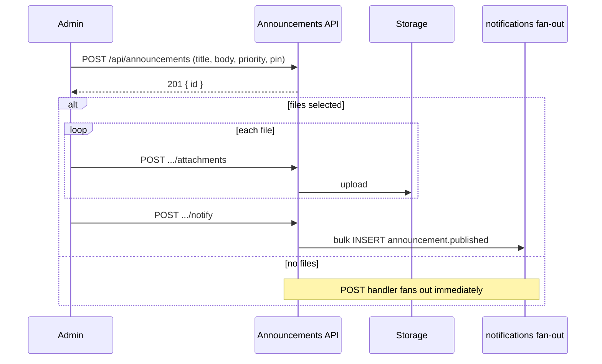
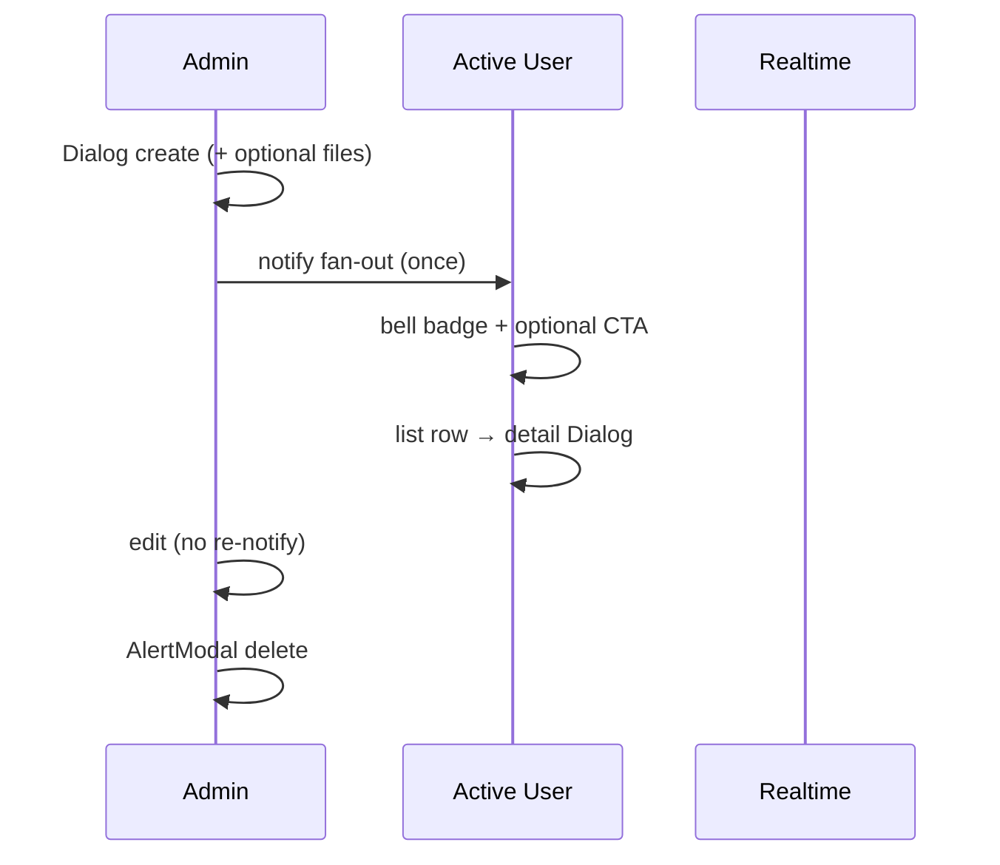

# 공지사항 (Announcements) 기획서

> Date: 2026-08-10  
> Status: Approved  
> Author: planner  
> **SQL:** `41` · `42` · [supabase/sql/41_announcements.sql](../../supabase/sql/41_announcements.sql) · [supabase/sql/42_notifications_announcement_type.sql](../../supabase/sql/42_notifications_announcement_type.sql)  
> **선행:** [08](./08_activity-audit-log-plan.md), [14](./14_delete-confirm-dialog-plan.md), [27](./27_in-app-notifications-user-update-plan.md), [37](./37_notifications-read-optimistic-update-plan.md), [38](./38_contract-attachment-size-limit-plan.md)

## 선행 plan 참조 (Phase 0)

| Plan | Status | 관계 |
|------|--------|------|
| **08** | Approved | CUD Route **전 HTTP 분기** `recordActivityLog` — `announcement.*` action 신규 |
| **14** | Completed | 공지·첨부 **hard delete** 시 `AlertModal` · `window.confirm` **금지** |
| **27** | Approved | `notifications` fan-out · Realtime INSERT · CTA redirect 패턴 **재사용** |
| **37** | Completed | read optimistic — 신규 type CTA만 확장, mutation 변경 **Out** |
| **38** | Completed | 첨부 용량 **파일 10MB · 공지당 총량 50MB** — contracts 상수·검증 패턴 **미러** |

**중복 금지:** 별도 `draft/published` 상태 테이블 **없음**. fan-out INSERT는 activity log **Out** (`announcement.create`로 충분). 계약 첨부 **soft delete** 패턴 **사용하지 않음** (공지 첨부는 hard delete).

---

## 한 줄 요약

Overview nav·overview 위젯·`/dashboard/announcements` 목록/상세 Dialog로 **전 로그인 사용자**가 공지를 Read하고, **admin**은 Dialog로 plain textarea 공지를 create/edit·AlertModal로 hard delete하며, **최초 create 완료(첨부 업로드 포함) 후 1회만** active 전원에게 `announcement.published` in-app 알림을 fan-out한다.

---

## 정책 확정안 (deep-interview · battle-plan · `go`)

| 항목 | 확정 |
|------|------|
| **Nav** | Overview 그룹 **「공지사항」** → `/dashboard/announcements` · **전 authenticated** (`access` 없음) |
| **Overview 위젯** | pin-first → `created_at desc` fill · **최대 3건** · **「전체 보기 →」** 링크 |
| **상태** | **없음** — create 즉시 전체 노출 · archived/draft **Out** |
| **삭제** | 공지 **hard delete** · 첨부 **hard delete** · `AlertModal` 확인 |
| **수정** | 허용 · **재알림 없음** · `updated_at > created_at`이면 **「수정됨 {formatAbsoluteDateTimeKo(updated_at)}」** |
| **priority** | `normal` / `important` / `urgent` — **Badge만** (outline / warning / destructive) |
| **pin** | 동시 **최대 3건** · 초과 시 **400** |
| **목록** | pinned 섹션 + `created_at desc` · 행: title + **1줄 body excerpt** |
| **목록 페이징** | **무한 스크롤** — 알림 페이지(`notification-infinite-list`)와 동일 패턴 · cursor + `useSuspenseInfiniteQuery` + `IntersectionObserver` |
| **상세** | 행 클릭 → **read-only detail Dialog** · **`/[id]` page route Out** |
| **admin CUD UI** | create/edit **Dialog** (Sheet **금지**) · plain **textarea** |
| **UI 톤** | WakeOne `--card` / `--border` / `--muted-foreground` · Nexus 컬러 카드 배경 **금지** |
| **타임스탬프** | `@/lib/format-datetime` **`formatAbsoluteDateTimeKo` only** |
| **알림 fan-out** | **최초 create 1회** · **첨부 업로드 전부 완료 후** · edit·첨부 add/delete **재알림 없음** |
| **알림 대상** | `profiles.status = 'active'` 전원 (admin 포함) |
| **알림 type** | `announcement.published` |
| **알림 title/body** | `새 공지가 등록되었습니다` / `{공지 제목}` |
| **알림 metadata** | `{ kind: 'announcement.published', announcement_id }` — 본문·첨부명 **저장 금지** |
| **알림 CTA** | **「공지 보기」** → `/dashboard/announcements?announcement={id}` (detail Dialog auto-open) |
| **첨부** | **In** — 파일당 **10MB** · 공지당 **50MB** · bucket `announcement-attachments` |
| **첨부 다운로드** | **전 authenticated** (contracts admin-only와 **다름**) |
| **designer (`승인` 후)** | 페이지 레이아웃 **3안** + 모달 UI **3안** (채팅 프리뷰 **6 total**) |

---

## 목표 & 완료 기준 (AC)

| # | 검증 | Given | When | Then |
|---|------|-------|------|------|
| 1 | Playwright | active user | 사이드바 Overview | **「공지사항」** 항목 표시 · 클릭 시 `/dashboard/announcements` |
| 2 | Playwright | admin, 공지 0건 | **공지 작성** Dialog에서 제목·본문 입력 후 **저장** (첨부 없음) | 목록 1행 · overview 위젯 1행 · active user B 벨 unread **증가** |
| 3 | Playwright | admin, 첨부 1개 선택 create | 제목·본문·파일 저장 | **모든 첨부 업로드 완료 후** B 벨에 알림 **1건** · 업로드 중간에는 unread **증가 없음** |
| 4 | Playwright | user B, AC#2 또는 #3 직후 | 벨 Popover | title **「새 공지가 등록되었습니다」** · body에 공지 **제목** · CTA **「공지 보기」** |
| 5 | Playwright | user B | CTA **「공지 보기」** 클릭 | `/dashboard/announcements?announcement={id}` · **상세 Dialog** 자동 open · 본문 전체·첨부 목록(있으면) |
| 6 | Playwright | admin | 공지 **수정** 저장 | **「수정됨」** + `formatAbsoluteDateTimeKo(updated_at)` (`yyyy-MM-dd (EEE) HH:mm:ss`) · B 벨 **신규 알림 없음** |
| 7 | Playwright | admin, pinned 3건 | 4번째 공지 pin 시도 | **400** · **「고정 공지는 최대 3개까지 가능합니다.」** |
| 8 | Playwright | admin | 공지 **삭제** → `AlertModal` 확인 | 목록·overview에서 제거 · `window.confirm` **미사용** |
| 9 | Playwright | user (non-admin) | `/dashboard/announcements` | **작성/수정/삭제/첨부 업로드 UI 없음** · 공지 Read·첨부 **다운로드** 가능 |
| 10 | Playwright | admin | `/dashboard/overview` | pin 우선 + latest fill **최대 3건** · **「전체 보기 →」** → `/dashboard/announcements` |
| 11 | Playwright | user B | 목록 행 클릭 | read-only **detail Dialog** · 별도 `/dashboard/announcements/[id]` **navigate 없음** |
| 11a | Playwright | DB에 공지 **11건 이상** (또는 E2E seed) | `/dashboard/announcements` 진입 후 목록 **하단까지 스크롤** | 첫 페이지(`ANNOUNCEMENTS_PAGE_SIZE`) 이후 **추가 행 lazy load** · 하단 **`PageLoadingSpinner variant="compact"`** 표시 · **전체 목록 로드 완료**까지 반복 |
| 12 | API | admin | **11MB** 단일 첨부 업로드 | **400** · 한국어 **파일당 용량** 오류 · `announcement.attachment_upload` **실패** log |
| 13 | API | admin, 활성 첨부 총량 45MB | **6MB** 추가 업로드 | **400** · 한국어 **공지당 총량 50MB** 오류 |
| 14 | API | user B (non-admin) | `GET /api/announcements/{id}/attachments/{attachmentId}/download` | **200** · 원 파일명 다운로드 |
| 15 | API | admin | 공지 create 2xx | `activity_logs` **1건** · action **`announcement.create`** |
| 16 | API | admin | 첨부 upload 2xx | action **`announcement.attachment_upload`** |
| 17 | API | admin | 첨부 delete 2xx | action **`announcement.attachment_delete`** |
| 18 | API | admin | 공지 delete 2xx | action **`announcement.delete`** · Storage blob **전부 제거** |
| 19 | Playwright | user B | admin이 삭제한 공지 id로 CTA 접근 | Dialog **「삭제된 공지입니다」** (또는 동등 empty) · 앱 **크래시 없음** |
| 20 | CLI | 구현 완료 후 | `bunx playwright test e2e/announcements/` · `npx tsc --noEmit` · `npm run lint:strict` · `npm run build` | 모두 통과 |

**회귀:** plan 27 Realtime·read optimistic · plan 38 용량 상수 패턴 · plan 14 AlertModal.

---

## 범위 (In / Out)

### In Scope (구현 순서: **BE SQL → BE API → FE → Notifications → E2E**)

| 순서 | 영역 | 내용 |
|------|------|------|
| A | **SQL 41** | `announcements` · `announcement_attachments` · bucket `announcement-attachments` · RLS · cascade |
| B | **SQL 42** | `notifications.type` check에 `announcement.published` |
| C | **BE CRUD** | announcements GET/POST · `[id]` GET/PUT/DELETE · overview GET |
| D | **BE notify** | `POST /api/announcements/[id]/notify` — **1회 fan-out** (`notified_at` idempotent) |
| E | **BE attachments** | upload · download (authenticated) · delete (admin) |
| F | **BE activity log** | `announcement.create/update/delete/attachment_upload/attachment_delete` |
| G | **FE feature** | `src/features/announcements/api/*` · queries · mutations |
| H | **FE UI** | list page · detail Dialog · admin form Dialog · overview widget |
| I | **Notifications** | fan-out helper · type · CTA · `notification-helpers.ts` |
| J | **Nav** | Overview **공지사항** |
| K | **E2E** | `e2e/announcements/*.spec.ts` |

### Out of Scope

| 항목 | 비고 |
|------|------|
| draft / published / archived 상태 | **Out** |
| `/dashboard/announcements/[id]` page route | **Out** — Dialog + query param만 |
| Tiptap·rich text | **Out** |
| 댓글·좋아요 | **Out** |
| 이메일·푸시 | **Out** |
| Nexus 컬러 카드 배경 | **금지** |
| 첨부 soft delete | **Out** — hard delete only |
| fan-out INSERT activity log | **Out** |
| edit·첨부 변경 재알림 | **Out** |
| inactive 사용자 소급 알림 | **Out** |

---

## DB (`supabase/sql/41_announcements.sql`)

```sql
-- Plan: 39_announcements-plan.md
-- Date: 2026-08-10
-- Status: Approved

create table public.announcements (
  id bigint generated always as identity primary key,
  title text not null check (char_length(trim(title)) between 1 and 120),
  body text not null check (char_length(trim(body)) between 1 and 5000),
  priority text not null default 'normal'
    check (priority in ('normal', 'important', 'urgent')),
  is_pinned boolean not null default false,
  created_by uuid not null references auth.users(id),
  notified_at timestamptz,  -- fan-out 완료 시각 (NULL = 미발송)
  created_at timestamptz not null default now(),
  updated_at timestamptz not null default now()
);

create table public.announcement_attachments (
  id bigint generated always as identity primary key,
  announcement_id bigint not null references public.announcements(id) on delete cascade,
  file_name text not null,
  file_size integer not null check (file_size > 0 and file_size <= 10485760),
  content_type text,
  storage_path text not null,
  uploaded_by uuid not null references auth.users(id),
  created_at timestamptz not null default now()
);

create index idx_announcements_list
  on public.announcements (is_pinned desc, created_at desc, id desc);

create index idx_announcement_attachments_announcement
  on public.announcement_attachments (announcement_id, created_at desc);

-- updated_at trigger on announcements
-- Storage bucket: announcement-attachments, file_size_limit = 10485760
-- RLS: SELECT announcements + attachments = authenticated
-- INSERT/UPDATE/DELETE announcements + attachments mutations = Route service_role only
```

| 컬럼 | 용도 |
|------|------|
| `notified_at` | create fan-out **1회** 보장 · `POST .../notify` idempotent |
| `announcement_attachments.storage_path` | `{announcement_id}/{uuid}/{file_name}` **[INFERRED]** |

**Pin 검증 (API):** `is_pinned=true` 시 `count(*) where is_pinned` **< 3** 아니면 400.

**Hard delete cascade:** `DELETE announcements` → FK cascade attachments rows → Route에서 Storage objects **bulk remove** 후 DB delete.

---

## API / Service Layer

### Announcements

| Route | Method | Role | 동작 |
|-------|--------|------|------|
| `/api/announcements` | GET | authenticated | **cursor pagination** (`limit` · `cursor` · `hasMore` · `nextCursor`) · 정렬: **pin 상단 고정 후** `created_at desc, id desc` · excerpt는 FE truncate 또는 BE 파생 |
| `/api/announcements` | POST | admin | INSERT · **첨부 없으면 즉시 fan-out** · **첨부 있으면 fan-out 생략** (`notified_at` NULL) |
| `/api/announcements/overview` | GET | authenticated | pin-first → latest · **limit 3** |
| `/api/announcements/[id]` | GET | authenticated | 단건 + attachments[] · 404 |
| `/api/announcements/[id]` | PUT | admin | update · pin 검증 · **fan-out 없음** |
| `/api/announcements/[id]` | DELETE | admin | hard delete + Storage cleanup |
| `/api/announcements/[id]/notify` | POST | admin | `notified_at IS NULL`일 때만 fan-out → set `notified_at=now()` · 이미 발송 시 **200 idempotent** |

### Attachments (contracts 패턴 미러 · download RBAC **다름**)

| Route | Method | Role | 동작 |
|-------|--------|------|------|
| `/api/announcements/[id]/attachments` | POST | admin | multipart upload · 10MB/file · 50MB/total |
| `/api/announcements/[id]/attachments/[attachmentId]` | DELETE | admin | hard delete + Storage remove · **재알림 없음** |
| `/api/announcements/[id]/attachments/[attachmentId]/download` | GET | **authenticated** | blob stream · READ log **Out** |

### Create + notify 시퀀스 (FE Dialog)



### Fan-out (`fan-out.server.ts` 확장)

```ts
// listActiveUserIds() — profiles.status = 'active'
// insertAnnouncementPublishedNotifications({ announcementId, title })
// type: 'announcement.published'
// 실패 catch — mutation 응답 변경하지 않음 (plan 27)
```

### Feature 구조 (core-conventions)

```
src/features/announcements/api/
  types.ts              — limits constants (mirror contracts 10/50MB)
  service.ts
  service.server.ts     — encode/decode cursor (notifications 패턴 미러)
  keys.ts               — announcementKeys + ANNOUNCEMENTS_PAGE_SIZE
  queries.ts            — announcementsInfiniteQueryOptions
  mutations.ts          — onSettled invalidate announcementKeys.all
  attachment-limits.ts  — [INFERRED] shared error/hint strings
src/features/announcements/components/
  announcement-infinite-list.tsx  — IntersectionObserver + loadMoreRef (notification-infinite-list 미러)
```

**Read (목록):** `useSuspenseInfiniteQuery(announcementsInfiniteQueryOptions)` — **`useQuery`/`useSuspenseQuery` 단일 페이지 금지**  
**Read (overview·단건):** `useSuspenseQuery`  
**CUD:** `mutations.ts` → service → `/api/*`

### 첨부 용량 (plan 38 동일 수치)

| 규칙 | 값 |
|------|-----|
| 파일 1개당 | **10MB** (10 485 760 bytes) |
| 공지 1건당 활성 첨부 총량 | **50MB** (52 428 800 bytes) |
| 파일 개수 | **무제한** (용량만) |
| 파일명 중복 | 동일 `announcement_id` 내 **금지** (contracts 패턴) |

상수·hint·에러 문구: `src/features/announcements/api/types.ts` — contracts `types.ts`와 **동일 수치**, 문구만 「공지」로 치환.

---

## 활동 감사 로그

> `core-conventions.mdc` §활동 감사 로그 · [plan 08](./08_activity-audit-log-plan.md)

### 기록 범위

| 구분 | 기록 |
|------|------|
| `announcement.create` | **In** |
| `announcement.update` | **In** |
| `announcement.delete` | **In** |
| `announcement.attachment_upload` | **In** |
| `announcement.attachment_delete` | **In** |
| `POST .../notify` fan-out | **Out** (create log로 충분) |
| GET announcements / download | **Out** (READ) |
| fan-out INSERT | **Out** |

### 기록 연동

| Route | action | target_type | return 분기 |
|-------|--------|-------------|-------------|
| `POST /api/announcements` | `announcement.create` | `announcement` | 401 · 403 · 400 · 201 · 500 |
| `PUT /api/announcements/[id]` | `announcement.update` | `announcement` | 401 · 403 · 400 · 404 · 200 · 500 |
| `DELETE /api/announcements/[id]` | `announcement.delete` | `announcement` | 401 · 403 · 404 · 200 · 500 |
| `POST .../attachments` | `announcement.attachment_upload` | `announcement` | 401 · 403 · 400 · 404 · 201 · 500 |
| `DELETE .../attachments/[attachmentId]` | `announcement.attachment_delete` | `announcement` | 401 · 403 · 404 · 200 · 500 |

**`ActivityAction` 확장:** 위 5 action  
**`ActivityTargetType` 확장:** `announcement`  
**`ACTION_LABELS`:** 공지 등록 · 공지 수정 · 공지 삭제 · 공지 첨부 업로드 · 공지 첨부 삭제  
**metadata:** `announcement_id` · `file_name`(upload/delete) · **본문·첨부 blob 저장 금지**

**삭제 확인 Dialog:** 공지 delete · 첨부 delete — **`AlertModal` 필수** (AC #8).

---

## UI 요구사항 (designer / FE)

### 공통

| 항목 | 내용 |
|------|------|
| **토큰** | `--card` · `--border` · `--muted-foreground` · priority **Badge only** |
| **금지** | Nexus red/yellow/green **tinted card backgrounds** |
| **타임스탬프** | `formatAbsoluteDateTimeKo` · `font-mono text-xs whitespace-nowrap` |
| **수정 표시** | `updated_at > created_at` → **「수정됨 {datetime}」** |
| **로딩** | `/dashboard/announcements/loading.tsx` — `PageLoadingSpinner` |
| **overview** | 기존 skeleton 패턴 (`BirthdayCelebrantsSection` 참고) |

### `/dashboard/announcements`

- `PageContainer` — `pageTitle="공지사항"`
- 목록: **`AnnouncementInfiniteList`** — `useSuspenseInfiniteQuery` + 하단 sentinel `IntersectionObserver` (`rootMargin: 120px`) · 다음 페이지 로드 중 `PageLoadingSpinner variant="compact"`
- **페이지 크기:** `ANNOUNCEMENTS_PAGE_SIZE = 10` (notifications `NOTIFICATIONS_PAGE_SIZE`와 동일 패턴 · 값은 constants로 분리)
- pinned는 **API 정렬**로 상단 유지 · 무한 스크롤은 **cursor 기준 다음 페이지** (pin 섹션 UI 분리는 designer 3안에서 결정)
- 행 = title + 1-line excerpt + priority Badge + pin Badge + created_at
- 행 클릭 → **read-only detail Dialog** (본문 `whitespace-pre-wrap` · 첨부 download links)
- admin toolbar: **「공지 작성」** → form Dialog
- admin detail Dialog footer: **수정** · **삭제** (`AlertModal`)
- nuqs `announcement` — 알림 CTA deep-link → Dialog auto-open

### Admin form Dialog (create/edit)

- **Dialog** (Sheet **금지**)
- 필드: title · body (plain textarea) · priority Select · pin Switch
- 첨부: file input · hint (10MB/50MB) · contracts FE 검증 패턴
- **Create submit:** POST → uploads → POST notify (if files)
- **Edit submit:** PUT only · 새 첨부 upload allowed · **notify 호출 금지**
- 성공 시 `form.reset()` (core-conventions §폼 초기화)

### Overview widget

- `AnnouncementsOverviewSection` — max 3 · **「전체 보기 →」**
- `overview/layout.tsx` left column Suspense

### designer deliverable (`승인` 게이트 **이후** · 채팅)

1. **페이지 레이아웃 3안** — Nexus list **개념** only · WakeOne neutral cards
2. **모달 UI 3안** — (detail read Dialog · admin form Dialog) 레이아웃·밀도·footer variation
3. **총 6 프리뷰** — 구현 전 사용자 선택용

---

## 영향 파일 & 패턴 (정찰)

| 파일 | 변경 |
|------|------|
| `supabase/sql/41_announcements.sql` | **신규** |
| `supabase/sql/42_notifications_announcement_type.sql` | **신규** |
| `src/app/api/announcements/**` | **신규** Routes |
| `src/features/announcements/**` | **신규** feature |
| `src/features/notifications/api/fan-out.server.ts` | fan-out + `listActiveUserIds` |
| `src/features/notifications/api/types.ts` | `announcement.published` |
| `src/features/notifications/components/notification-helpers.ts` | CTA **「공지 보기」** |
| `src/features/activity-logs/api/types.ts` · `labels.ts` | action · target_type |
| `src/config/nav-config.ts` | Overview **공지사항** |
| `src/app/dashboard/announcements/page.tsx` · `loading.tsx` | **신규** |
| `src/app/dashboard/overview/layout.tsx` | overview widget slot |
| `src/lib/searchparams.ts` | `announcement` query |
| `e2e/announcements/*.spec.ts` | **신규** |

**참조 구현:** `src/features/contracts/api/types.ts` (limits) · attachment Routes · `user-profile-modal.tsx` (Dialog) · `BirthdayCelebrantsSection` (overview) · **`notification-infinite-list.tsx` + `notifications/api/queries.ts` + `service.server.ts` cursor** · plan 27 fan-out

---

## 리스크 & 완화

| # | 등급 | 리스크 | 완화 |
|---|------|--------|------|
| 1 | HIGH | active 전원 bulk fan-out timeout | batch INSERT · catch · notify 200 유지 |
| 2 | HIGH | create 중 notify 조기 호출 | 첨부 있을 때 POST create **fan-out 생략** · client `POST notify` after uploads |
| 3 | HIGH | double fan-out | `notified_at` + notify idempotent |
| 4 | MED | pin 3개 race | PUT/POST count in transaction |
| 5 | MED | delete Storage orphan | delete Route: Storage first/batch then DB |
| 6 | MED | 삭제된 공지 CTA | Dialog empty state AC #19 |
| 7 | LOW | overview·list cache drift | `announcementKeys.all` onSettled invalidate |
| 8 | MED | pin 정렬 + cursor 페이지 경계 | cursor `(is_pinned, created_at, id)` 복합 키 · notifications `encodeNotificationCursor` 패턴 |

---

## 추정

| 항목 | 값 |
|------|-----|
| 복잡도 | **Complex** (CRUD + attachments + fan-out + overview) |
| SQL | 2 files (41, 42) |
| BE | ~8 Route handlers + fan-out |
| FE | feature + 3 Dialogs + overview widget |
| E2E | ~21 AC (#11a 포함) |
| 예상 시간 | **~6–8시간** |
| Checkpoint | SQL + create + notify 1 user 수신 (~2.5h) |

---

## requirements-pipeline Express (Phase 3)

### 가정 (Assumptions)

| ID | 가정 |
|----|------|
| A1 | plan 27 notifications·Realtime **구현됨** |
| A2 | create Dialog에서 첨부 선택 시 **notify는 uploads 완료 후** client가 호출 |
| A3 | 공지 첨부 download는 **계약과 달리** non-admin **허용** |
| A4 | `notified_at`이 non-null이면 **재notify API 호출해도 fan-out 없음** |

### 핵심 사용자 흐름



### E2E 범위

| 디렉터리 | spec (예) |
|----------|-----------|
| `e2e/announcements/` | `nav.spec.ts` · `list-detail-dialog.spec.ts` · `list-infinite-scroll.spec.ts` · `admin-crud.spec.ts` · `attachments-size.spec.ts` · `notify-fanout.spec.ts` · `overview-widget.spec.ts` |

**activity log API 검증:** AC #15–#18 — mutation Route `x-request-id` + `GET /api/activity-logs`.

---

## 구현 팀 전달 메모

### designer (`승인` 후)

- 페이지 3안 + 모달 3안 (6 total) · WakeOne tokens · Badge priority only
- admin form Dialog · read detail Dialog · overview widget mock

### backend-dev

- SQL 41·42 → CRUD + attachments + notify
- **`GET /api/announcements` cursor pagination** — `limit` · `nextCursor` · `hasMore` (notifications `service.server.ts` 패턴)
- fan-out **after attachments** · `notified_at` idempotent
- download **requireSession** (not admin-only)

### frontend-dev

- Dialog-only UX · nuqs `announcement` deep-link
- **목록:** `announcement-infinite-list.tsx` — notifications infinite scroll **미러** (`useSuspenseInfiniteQuery` · IntersectionObserver · compact spinner)
- create: POST → uploads → notify
- mutations `onSettled` invalidate · form reset on success

### verifier

- AC #1–#20 · #11a 무한 스크롤 · `bunx playwright test e2e/announcements/`
- activity log API AC #15–#18
- 절대 시각 AC #6

---

## 수정 이력

| 날짜 | 변경 내용 | 작성자 |
|------|----------|--------|
| 2026-08-10 | 최초 작성 (Approved) — deep-interview·battle-plan·첨부 In·notify-after-upload | planner |
| 2026-08-10 | 목록 **무한 스크롤** In — notifications cursor·InfiniteQuery·IntersectionObserver 패턴 | planner |
