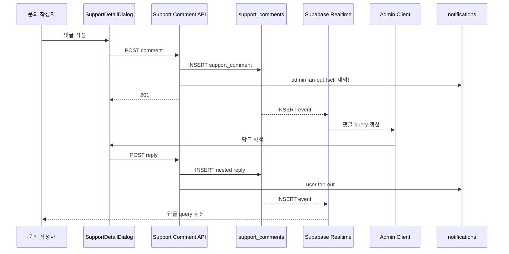

# CS 문의 Realtime 댓글/대댓글 및 알림 확장 기획서

> Date: 2026-08-20  
> Status: Approved  
> Author: planner  
> **SQL:** `46` 예정 · `supabase/sql/46_support_comments_notifications.sql`  
> **선행:** [08](./08_activity-audit-log-plan.md), [27](./27_in-app-notifications-user-update-plan.md), [37](./37_notifications-read-optimistic-update-plan.md), [42](./42_cs-support-plan.md)  
> **개발자 검증:** [43_cs-support-comments-notifications-dev-checklist.md](./43_cs-support-comments-notifications-dev-checklist.md) — **verifier Subagent Out** (수동 QA)

## 선행 plan 참조 (Phase 0)

| Plan | Status | 관계 |
|------|--------|------|
| **08** activity-audit-log | Approved | 댓글 CUD Route **전 HTTP 분기** `recordActivityLog` · `support.comment_*` action 신규 |
| **27** notifications | Approved | `notifications` 테이블 · Realtime INSERT · admin/user notification 조회·읽음 처리 패턴 재사용 |
| **37** notifications optimistic | Completed | 알림 read/read-all optimistic update 유지 · 신규 support 알림 type만 확장 |
| **42** cs-support | Approved | `/dashboard/support` 단일 URL · support_requests/list/detail Dialog/status workflow의 직접 후속 확장 |

**중복 금지:** 별도 `/dashboard/support/[id]` page route, 이메일/Nodemailer, 댓글 hard delete, 특정 댓글 스크롤 deep-link는 만들지 않는다. 기존 plan 42의 support create/update/status activity log는 유지하고, 본 plan은 댓글 CUD와 in-app 알림 fan-out을 확장한다.

---

## 한 줄 요약

`/dashboard/support` 상세 Dialog 안에서 문의 작성자와 admin이 **임의 깊이 댓글/대댓글**로 계속 대화하고, 댓글 생성·수정·soft delete를 처리하며, 댓글 INSERT/UPDATE는 Supabase Realtime으로 새로고침 없이 반영한다. support 등록·수정·상태 변경·댓글/대댓글 작성은 in-app 알림을 발송하되 본인 액션은 제외하고, 모든 댓글 CUD는 activity log에 기록한다.

---

## 정책 확정안 (deep-interview · battle-plan · `go`)

| 항목 | 확정 |
|------|------|
| **대상 화면** | 기존 `/dashboard/support` · `SupportDetailDialog` 내부 댓글 영역 |
| **댓글 구조** | 답글의 답글이 계속 가능한 **임의 깊이** tree |
| **DB tree 모델** | `parent_id` adjacency list + `root_comment_id` · `path` · `depth` 보조 컬럼 |
| **Realtime** | `support_comments` **INSERT/UPDATE** 구독 · soft delete는 UPDATE · 상태 변경 Realtime **Out** |
| **작성 권한** | 문의 작성자와 admin만 댓글/답글 작성 가능 |
| **상태 잠금** | `completed` 상태에서도 댓글 작성·수정·삭제 가능 |
| **수정 권한** | 댓글 작성자 본인만 수정 가능 · admin 전체 수정은 **Out** |
| **삭제 권한** | 댓글 작성자 본인 삭제 가능 · admin은 모든 댓글 삭제 가능 |
| **삭제 방식** | hard delete **금지** · soft delete only · 삭제 전 `AlertModal` 필수 |
| **알림 제외** | 본인이 수행한 액션은 본인에게 알림 발송하지 않음 |
| **알림 클릭** | `/dashboard/support?support={id}`로 Dialog open · 특정 댓글 스크롤 **Out** |
| **알림 preview** | 본문 preview 포함 · UI는 `line-clamp-1` · metadata에 본문 전문/민감정보 저장 금지 |
| **목록 badge/status** | 상태 변경 및 목록 badge는 mutation/cache 갱신만 · Realtime **Out** |
| **검증** | **verifier Subagent Out** · [dev-checklist](./43_cs-support-comments-notifications-dev-checklist.md) 기준 수동 QA/API/CLI 검증 |

---

## 목표 & 완료 기준 (AC)

| # | 검증 | Given | When | Then |
|---|------|-------|------|------|
| AC-01 | Manual | user A가 본인 문의 상세 Dialog를 열었을 때 | 댓글 입력창에 본문을 입력하고 등록 | 댓글 1건이 표시되고 작성자 이름·절대 시각·본문이 보인다 |
| AC-02 | Manual | user A와 admin이 같은 문의 Dialog를 각각 열었을 때 | A가 댓글을 등록 | admin 화면에 새 댓글이 새로고침 없이 Realtime으로 표시된다 |
| AC-03 | Manual | admin과 user A가 같은 문의 Dialog를 각각 열었을 때 | admin이 답글을 등록 | user A 화면에 답글이 새로고침 없이 원댓글 아래 표시된다 |
| AC-04 | Manual | 원댓글 아래 답글이 있는 상태 | 답글에 다시 답글을 여러 단계 작성 | 각 답글이 부모 아래에 표시되고 depth별 연결선/들여쓰기가 유지된다 |
| AC-05 | Manual | depth가 시각 제한을 넘는 댓글 tree | 깊은 답글을 추가 | 데이터 depth는 유지되고 UI 들여쓰기는 max visual indent에서 clamp된다 |
| AC-06 | Manual | user A의 문의가 `completed` 상태일 때 | A가 댓글을 등록 | 댓글이 성공적으로 등록되고 상태는 변경되지 않는다 |
| AC-07 | Manual | user A가 본인 댓글을 볼 때 | 수정 버튼으로 본문을 변경 후 저장 | 댓글 본문이 갱신되고 `수정됨 {formatAbsoluteDateTimeKo(updated_at)}` 표시가 보인다 |
| AC-08 | Manual/API | user A가 타인의 댓글을 볼 때 | 댓글 action menu와 PATCH 직접 시도 | 수정 버튼이 보이지 않고 PATCH 직접 시도는 403이다 |
| AC-09 | Manual | user A가 본인 댓글 삭제를 누를 때 | `AlertModal`에서 취소 | 댓글 본문이 유지되고 삭제 mutation이 실행되지 않는다 |
| AC-10 | Manual | user A가 본인 댓글 삭제를 누를 때 | `AlertModal`에서 확인 | 댓글은 `삭제된 댓글입니다.`로 표시되고 자식 답글은 유지된다 |
| AC-11 | Manual | admin이 user A의 댓글을 볼 때 | 삭제를 확인 | 댓글이 soft delete 처리되고 자식 답글은 유지된다 |
| AC-12 | API | user B가 user A의 문의 id를 알고 있을 때 | 댓글 GET/POST/PATCH/DELETE API를 직접 호출 | 403 또는 404로 차단된다 |
| AC-13 | Manual | user A가 문의를 등록했을 때 | admin이 알림 Popover를 연다 | 알림 title/body에 CS 문의 등록 내용이 한 줄 preview로 표시되고 클릭 시 `/dashboard/support?support={id}` Dialog가 열린다 |
| AC-14 | Manual | user A가 pending 문의 제목/본문을 수정했을 때 | admin이 알림을 확인 | CS 문의 수정 알림이 표시되고 본인 액션 알림은 A에게 생성되지 않는다 |
| AC-15 | Manual | admin이 문의 상태를 `received` 또는 `completed`로 변경했을 때 | user A가 알림을 확인 | 어떤 문의 상태가 어떻게 변경됐는지 표시되고 클릭 시 support Dialog가 열린다 |
| AC-16 | Manual | user A가 댓글/대댓글을 작성했을 때 | admin이 알림을 확인 | 어떤 문의에 새 댓글/답글이 달렸는지 preview가 `line-clamp-1`로 표시된다 |
| AC-17 | Manual | admin이 댓글/대댓글을 작성했을 때 | user A가 알림을 확인 | 새 댓글/답글 알림이 표시되고 admin 본인에게는 알림이 생성되지 않는다 |
| AC-18 | API | user A가 댓글 생성 성공 | `POST /api/support/[id]/comments` 2xx 후 `GET /api/activity-logs` | `support.comment_create` 로그 1건과 `x-request-id`가 확인된다 |
| AC-19 | API | user A가 댓글 수정 성공 | `PATCH /api/support/[id]/comments/[commentId]` 2xx 후 로그 조회 | `support.comment_update` 로그 1건과 `changed_fields` metadata가 확인된다 |
| AC-20 | API | user A 또는 admin이 댓글 삭제 성공 | `DELETE /api/support/[id]/comments/[commentId]` 2xx 후 로그 조회 | `support.comment_delete` 로그 1건과 soft delete metadata가 확인된다 |
| AC-21 | API | user B가 user A의 댓글 수정 시도 | PATCH 호출 | 403 응답과 실패 activity log가 기록된다 |
| AC-22 | API | 댓글 body에 긴 민감 가능 문구가 있을 때 | 알림 row metadata를 확인 | metadata에 댓글 본문 전문·preview 전문·민감정보가 저장되지 않는다 |
| AC-23 | Manual | 삭제된 댓글의 알림 CTA를 클릭했을 때 | `/dashboard/support?support={id}` 진입 | Dialog가 열리고 앱이 크래시하지 않으며 삭제된 댓글은 placeholder로 표시된다 |
| AC-24 | CLI | 구현 완료 후 | [dev-checklist](./43_cs-support-comments-notifications-dev-checklist.md)의 CLI·수동 QA·API 항목 수행 | 필수 항목 전부 통과하고 테스트 데이터 cleanup이 완료된다 |

**회귀:** plan 42 support listing/create/update/status workflow, plan 27 notifications Realtime/read, plan 37 optimistic read, plan 08 activity log 전 분기 기록 유지.

---

## 범위 (In / Out)

### In Scope

| 순서 | 영역 | 내용 |
|------|------|------|
| A | **SQL 46** | `support_comments` · tree 보조 컬럼 · soft delete · RLS · indexes · Realtime publication |
| B | **Notifications SQL** | `notifications.type` check에 support 관련 type 추가 |
| C | **BE comments API** | 댓글 조회 · 생성 · 답글 생성 · 수정 · soft delete |
| D | **BE fan-out** | support create/update/status/comment/reply 알림 생성 |
| E | **BE activity log** | `support.comment_create` · `support.comment_update` · `support.comment_delete` 전 분기 |
| F | **FE feature API** | `src/features/support/api/{types,service,queries,mutations}` 확장 |
| G | **FE UI** | `SupportDetailDialog` 댓글 영역 · 임의 깊이 thread · inline reply/edit/delete · `AlertModal` |
| H | **FE Realtime** | Dialog open 중 support_comments INSERT/UPDATE 구독 · dedupe · invalidate |
| I | **Notifications UI** | support 알림 title/body/CTA helper · preview `line-clamp-1` |
| J | **Dev checklist** | [43 dev-checklist](./43_cs-support-comments-notifications-dev-checklist.md) 기준 Manual/API/CLI 자체 검증 |

### Out Scope

| 항목 | 비고 |
|------|------|
| 댓글 hard delete | **금지** — soft delete만 |
| admin 댓글 수정 | Out — admin은 전체 삭제만 가능 |
| 특정 댓글 스크롤 deep-link | Out — `?support={id}` Dialog open까지만 |
| 상태 변경 Realtime | Out — mutation/cache 갱신만 |
| 이메일·푸시·SMS | Out |
| 첨부·FAQ | plan 42와 동일하게 Out |
| 댓글 좋아요/멘션/파일 첨부 | 후속 plan |

---

## DB 요구사항 (`supabase/sql/46_support_comments_notifications.sql`)

### `support_comments`

```sql
-- Plan: 43_cs-support-comments-notifications-plan.md
-- Date: 2026-08-20
-- Status: Approved

create table public.support_comments (
  id bigint generated always as identity primary key,
  support_request_id bigint not null references public.support_requests(id) on delete cascade,
  author_user_id uuid not null references auth.users(id),
  parent_id bigint references public.support_comments(id),
  root_comment_id bigint references public.support_comments(id),
  path text not null,
  depth integer not null default 0 check (depth >= 0),
  body text not null check (char_length(trim(body)) between 1 and 5000),
  is_deleted boolean not null default false,
  deleted_at timestamptz,
  deleted_by uuid references auth.users(id),
  created_at timestamptz not null default now(),
  updated_at timestamptz not null default now()
);

create index idx_support_comments_request_path
  on public.support_comments (support_request_id, path);

create index idx_support_comments_request_created
  on public.support_comments (support_request_id, created_at, id);

create index idx_support_comments_parent
  on public.support_comments (parent_id);
```

| 컬럼 | 용도 |
|------|------|
| `parent_id` | 직접 부모 댓글 |
| `root_comment_id` | thread root grouping |
| `path` | 임의 깊이 정렬·순환 방지 보조 |
| `depth` | UI 들여쓰기·max visual indent 계산 |
| `is_deleted/deleted_at/deleted_by` | soft delete · hard delete 금지 |

### DB 정책

- `parent_id`는 같은 `support_request_id` 내 댓글만 허용.
- 자기 자신 또는 descendant를 parent로 지정할 수 없다.
- `root_comment_id`, `path`, `depth`는 서버에서 계산하고 클라이언트 payload는 무시한다.
- Realtime: `support_comments`는 `replica identity full` + `supabase_realtime` publication에 추가한다.
- RLS SELECT: 문의 작성자 또는 admin만.
- INSERT/UPDATE/DELETE: authenticated 직접 권한 revoke, Route Handler service_role만 수행.

### Notifications type 확장

신규 type 후보:

| type | 트리거 |
|------|--------|
| `support.created` | 문의 등록 |
| `support.updated` | 문의 제목/본문 수정 |
| `support.status_changed` | admin 상태 변경 |
| `support.comment_created` | 원댓글 작성 |
| `support.reply_created` | 답글 작성 |

댓글 수정/삭제 알림은 Out. activity log만 기록한다.

---

## 권한 / RBAC

| 대상 | 문의 작성자 | admin | 다른 user |
|------|-------------|-------|-----------|
| 댓글 조회 | ✅ | ✅ | ❌ |
| 댓글/답글 작성 | ✅ | ✅ | ❌ |
| 본인 댓글 수정 | ✅ | ✅(본인 댓글만) | ❌ |
| 타인 댓글 수정 | ❌ | ❌ | ❌ |
| 본인 댓글 삭제 | ✅ | ✅ | ❌ |
| 타인 댓글 삭제 | ❌ | ✅ | ❌ |
| `completed` 댓글 CUD | ✅ | ✅ | ❌ |

- UI 숨김은 보조이며, Route Handler에서 support ownership/admin을 재검증한다.
- 댓글 수정/삭제는 댓글별 author와 support 접근 권한을 모두 확인한다.
- 삭제는 모든 role에서 `AlertModal` 확인 후 mutation 실행.

---

## API / Service Layer

### Routes

| Route | Method | Role | 동작 |
|-------|--------|------|------|
| `/api/support/[id]/comments` | GET | owner/admin | 댓글 flat tree 조회 · `path` 정렬 |
| `/api/support/[id]/comments` | POST | owner/admin | 원댓글 생성 · 알림 fan-out · Realtime INSERT |
| `/api/support/[id]/comments/[commentId]/replies` | POST | owner/admin | 임의 depth 답글 생성 · parent 검증 |
| `/api/support/[id]/comments/[commentId]` | PATCH | comment author | body 수정 · Realtime UPDATE |
| `/api/support/[id]/comments/[commentId]` | DELETE | author/admin | soft delete · Realtime UPDATE · `AlertModal` UI |

### 기존 support Route 확장

| Route | 변경 |
|------|------|
| `POST /api/support` | 성공 후 admin fan-out `support.created` |
| `PATCH /api/support/[id]` user fields | 성공 후 admin fan-out `support.updated` |
| `PATCH /api/support/[id]` admin status | 성공 후 작성자 fan-out `support.status_changed` |

### Feature 구조

```
src/features/support/api/
  types.ts              — SupportComment, tree, notification payload types
  service.ts            — comments fetch/create/update/delete wrappers
  service.server.ts     — support access + comment tree helpers
  keys.ts               — supportKeys.comments(id)
  queries.ts            — supportCommentsQueryOptions
  mutations.ts          — create/update/delete comment mutations, onSettled invalidate
src/features/support/components/
  support-comments-section.tsx
  support-comment-thread.tsx
  support-comment-item.tsx
  support-comment-form.tsx
  support-comment-realtime.tsx
```

**Read:** `useSuspenseQuery(supportCommentsQueryOptions(id))`  
**CUD:** `mutations.ts` → `service.ts` → `/api/*` · `onSettled`에서 `supportKeys.all` 또는 `supportKeys.comments(id)` invalidate  
**Realtime:** INSERT/UPDATE 수신 시 id 기준 dedupe 후 comments query invalidate 또는 cache patch

---

## Realtime 정책

| 이벤트 | 처리 |
|--------|------|
| 댓글 INSERT | Dialog open 중 구독 · 새 댓글/답글 반영 |
| 댓글 UPDATE | 수정·soft delete 반영 |
| 댓글 DELETE | 없음 — hard delete 금지 |
| status 변경 | Realtime Out |
| 목록 badge | Realtime Out · mutation/cache 갱신 |

- 구독 filter: `support_request_id=eq.{id}`
- Realtime event와 mutation response 중복은 `comment.id` 기준 dedupe.
- `path`와 `depth`가 payload에 포함되어야 tree 재정렬이 가능하다.
- Dialog unmount 시 channel unsubscribe.

---

## 알림 이벤트 매트릭스

| 이벤트 | type | 수신자 | 본인 제외 | body/preview |
|--------|------|--------|-----------|--------------|
| 문의 등록 | `support.created` | active admin 전원 | ✅ | `{문의 제목}` + 본문 preview 한 줄 |
| 문의 수정 | `support.updated` | active admin 전원 | ✅ | `{문의 제목}` 수정 알림 + 변경 내용 preview 한 줄 |
| 상태 변경 | `support.status_changed` | 문의 작성자 | ✅ | `{문의 제목}` 상태가 `{이전}`→`{신규}`로 변경 |
| 원댓글 작성 | `support.comment_created` | user 작성 시 admin 전원, admin 작성 시 문의 작성자 | ✅ | 댓글 preview 한 줄 |
| 답글 작성 | `support.reply_created` | user 작성 시 admin 전원, admin 작성 시 문의 작성자 | ✅ | 답글 preview 한 줄 |
| 댓글 수정 | 없음 | 없음 | — | activity log만 |
| 댓글 삭제 | 없음 | 없음 | — | activity log만 |

### 알림 metadata allowlist

| key | 설명 |
|-----|------|
| `kind` | support notification kind |
| `support_request_id` | Dialog deep-link 대상 |
| `comment_id` | 댓글 알림 식별용 |
| `parent_id` | 답글인 경우 |
| `previous_status` / `new_status` | 상태 변경 |

본문 전문, preview 전문, 이메일, 토큰, 민감정보는 metadata 저장 금지. 알림 CTA는 모두 `/dashboard/support?support={id}`.

---

## 활동 감사 로그

> `core-conventions.mdc` §활동 감사 로그 · [plan 08](./08_activity-audit-log-plan.md)

### 기록 범위

| 구분 | 기록 |
|------|------|
| `support.create` | **유지** (plan 42) |
| `support.update` | **유지** (plan 42) |
| `support.status_update` | **유지** (plan 42) |
| `support.comment_create` | **In** |
| `support.comment_update` | **In** |
| `support.comment_delete` | **In** |
| GET comments | **Out** (READ) |
| notification fan-out INSERT | **Out** (원 mutation log로 충분) |

### 기록 연동

| Route | action | target_type | return 분기 |
|-------|--------|-------------|-------------|
| `POST /api/support/[id]/comments` | `support.comment_create` | `support_comment` | 401 · 403 · 400 · 404 · 201 · 500 |
| `POST /api/support/[id]/comments/[commentId]/replies` | `support.comment_create` | `support_comment` | 401 · 403 · 400 · 404 · 201 · 500 |
| `PATCH /api/support/[id]/comments/[commentId]` | `support.comment_update` | `support_comment` | 401 · 403 · 400 · 404 · 200 · 500 |
| `DELETE /api/support/[id]/comments/[commentId]` | `support.comment_delete` | `support_comment` | 401 · 403 · 404 · 200 · 500 |

**`ActivityAction` 확장:** `support.comment_create` · `support.comment_update` · `support.comment_delete`  
**`ActivityTargetType` 확장:** `support_comment`  
**`ACTION_LABELS`:** CS 댓글 등록 · CS 댓글 수정 · CS 댓글 삭제  

### metadata allowlist

| action | keys |
|--------|------|
| create 2xx | `support_request_id` · `comment_id` · `parent_id` · `root_comment_id` · `depth` |
| update 2xx | `support_request_id` · `comment_id` · `changed_fields` |
| delete 2xx | `support_request_id` · `comment_id` · `deleted_by_admin` |
| 4xx/5xx | `error_code` · `message` |

본문 전문·preview 전문·이메일·토큰 metadata 저장 금지.

---

## UI 요구사항 (designer / FE)

### `SupportDetailDialog` 댓글 영역

- 기존 문의 본문/status 영역 아래에 댓글 섹션 추가.
- 댓글 목록은 flat ordered data를 tree처럼 렌더링.
- 임의 depth 답글을 지원하되 UI indent는 max visual indent로 clamp.
- connector line으로 부모/자식 관계를 시각화.
- 모바일에서는 indent 폭 축소 또는 더 낮은 visual clamp 적용.
- 빈 상태: `아직 댓글이 없습니다. 첫 댓글을 남겨보세요.`

### 댓글 item

- 작성자 이름, role/admin 표시, 절대 시각 `formatAbsoluteDateTimeKo`.
- 수정됨 표시: `수정됨 {formatAbsoluteDateTimeKo(updated_at)}`.
- 삭제된 댓글은 `삭제된 댓글입니다.` placeholder.
- 삭제된 댓글의 답글은 유지.
- 버튼: 답글, 수정(본인만), 삭제(본인 또는 admin).

### 댓글 form

- 하단 원댓글 form.
- 답글 버튼 클릭 시 해당 댓글 아래 inline reply form.
- 수정 버튼 클릭 시 inline edit form.
- mutation pending 중 버튼 loading 표시.
- 실패 시 form 내용 유지.

### 삭제 확인

- `@/components/modal/alert-modal`의 `AlertModal` 사용.
- `window.confirm`/`window.alert` 금지.
- confirm copy: `댓글을 삭제하시겠습니까?`
- description: `댓글 내용은 숨겨지고 답글은 유지됩니다.`

### 알림 UI

- support 알림 helper에서 title/body/CTA label 한국어 처리.
- 댓글 preview는 NotificationCard에서 `line-clamp-1`.
- CTA label 예: `문의 보기`.
- 클릭 시 `/dashboard/support?support={id}`.

---

## 개발자 자체 검증 계획

> `/root` 파이프라인에서 **verifier Subagent Out**. 개발 완료 후 담당자가 [43_cs-support-comments-notifications-dev-checklist.md](./43_cs-support-comments-notifications-dev-checklist.md)를 기준으로 수동 QA/API/CLI 검증을 수행한다.

### Manual QA

- 댓글/답글 생성, 임의 depth, Realtime 반영, completed 댓글 허용.
- 본인 수정, 권한 차단, soft delete, AlertModal.
- 등록/수정/status/comment/reply 알림과 CTA.
- 타 user 접근 차단.

### API

- 댓글 CUD `x-request-id` 헤더 확인.
- `GET /api/activity-logs`에서 `support.comment_create/update/delete` 성공·실패 행 확인.
- notification metadata에 본문 전문/preview 전문이 없는지 확인.
- soft delete 후 GET comments에서 placeholder 상태 확인.

### CLI / 품질

- `npx tsc --noEmit`
- `npm run lint:strict`
- react-doctor
- `npm run build`
- 원격 목 데이터 cleanup: 생성한 support request, comments, notifications 검증용 대상 정리 가능한 범위 명시

### 선택 Playwright

- verifier 자동 실행은 생략한다.
- 여유가 있으면 AC 기반 spec을 추가하고 `bunx playwright test e2e/support/`를 선택 실행한다.

---

## 영향 파일 & 패턴

| 파일 | 변경 |
|------|------|
| `supabase/sql/46_support_comments_notifications.sql` | 신규 SQL |
| `src/app/api/support/[id]/comments/**` | 신규 comments Routes |
| `src/app/api/support/[id]/route.ts` | status/user update fan-out 보강 |
| `src/app/api/support/route.ts` | create fan-out 보강 |
| `src/features/support/api/*` | comments types/service/queries/mutations 확장 |
| `src/features/support/components/support-detail-dialog.tsx` | 댓글 섹션 통합 |
| `src/features/support/components/support-comment-*.tsx` | 신규 댓글 UI |
| `src/features/notifications/api/types.ts` | support notification type 확장 |
| `src/features/notifications/api/fan-out.server.ts` | support fan-out helper 확장 |
| `src/features/notifications/components/notification-helpers.ts` | support CTA/helper |
| `src/features/activity-logs/api/types.ts` · `labels.ts` | action/target label 확장 |
| `src/lib/searchparams.ts` | 기존 `support` 유지, 댓글 scroll param 추가 없음 |
| `docs/plans/43_cs-support-comments-notifications-dev-checklist.md` | 수동 QA checklist |
| `e2e/support/*.spec.ts` | 선택 Playwright spec (verifier 자동 실행 Out) |

---

## 리스크 & 완화

| # | 등급 | 리스크 | 완화 |
|---|------|--------|------|
| 1 | HIGH | 임의 depth tree 정렬/렌더링 성능 저하 | `path`/`depth`/`root_comment_id` 저장 · API flat ordered 반환 · UI visual indent clamp |
| 2 | HIGH | 순환 parent 또는 cross-support parent로 tree 손상 | Route 검증 + DB trigger/constraint · parent chain 검증 |
| 3 | HIGH | Realtime과 mutation response 중복 반영 | `comment.id` dedupe · `onSettled` invalidate 유지 |
| 4 | MED | admin 전원 fan-out 과다 | active admin batch insert · self-action skip · fan-out 실패가 원 mutation 응답을 깨지 않도록 catch |
| 5 | MED | 알림 preview 민감정보 노출 | metadata 본문 저장 금지 · UI `line-clamp-1` · 필요 시 댓글 입력 주의 copy |
| 6 | MED | hard delete로 대화 맥락 파괴 | hard delete 금지 · soft delete placeholder와 자식 유지 |
| 7 | LOW | 자동 verifier 없이 회귀 누락 | dev-checklist에 CLI·DB·Manual·API·cleanup 항목을 분리해 필수 확인 |

---

## 추정

| 항목 | 값 |
|------|-----|
| 복잡도 | **Complex** |
| SQL | 1 파일 (`46`) + notifications type check 확장 |
| BE | comments 5 Route + 기존 support 2 Route fan-out 보강 + activity log |
| FE | support 댓글 API/UI/Realtime + notification helper |
| Manual/API | dev-checklist 기반 support 댓글·알림·activity log 자체 검증 |
| 예상 시간 | **~8–11시간** |
| Checkpoint | SQL + 댓글 생성/조회 + Dialog thread 렌더링 완료 후 Realtime/알림/삭제 확장 |

---

## requirements-pipeline Express (Phase 3)

### 가정 (Assumptions)

| ID | 가정 |
|----|------|
| A1 | plan 42 support_requests와 `/dashboard/support` UI가 구현되어 있다 |
| A2 | plan 27 notifications·Realtime INSERT·읽음 처리 기반이 구현되어 있다 |
| A3 | support 댓글은 문의 작성자와 admin 사이의 대화이며 별도 public thread가 아니다 |
| A4 | UI는 임의 depth를 데이터로 보존하지만 과도한 들여쓰기는 visual clamp한다 |

### 핵심 흐름



### 검증 시나리오

| 시나리오 | 기대 |
|----------|------|
| Happy path | user/admin이 같은 Dialog에서 댓글·답글을 Realtime으로 주고받음 |
| Deep thread | 답글의 답글이 계속 가능하고 UI는 visual clamp |
| Edit/delete | 본인 수정·본인 삭제·admin 삭제 가능, hard delete 없음 |
| RBAC | 타 user 댓글 접근과 mutation 차단 |
| Notification | support 등록/수정/status/comment/reply 알림과 self skip |
| Audit | 댓글 CUD 성공·실패 activity log 기록 |

---

## 구현 팀 전달 메모

### designer

- `SupportDetailDialog` 안 댓글 영역 설계: 임의 depth thread, connector line, max visual indent, inline reply/edit/delete.
- soft delete placeholder와 AlertModal 삭제 확인 copy 포함.
- 알림 preview는 `line-clamp-1`, CTA는 `문의 보기`.

### backend-dev

- SQL `46`: `support_comments` + RLS + tree 보조 컬럼 + Realtime publication + notifications type check 확장.
- comments GET/POST/reply/PATCH/DELETE Route와 기존 support create/update/status fan-out 보강.
- 모든 댓글 CUD return 분기 `recordActivityLog`; metadata에는 본문 전문 저장 금지.

### frontend-dev

- `src/features/support/api/*` service/query/mutation 확장, CUD는 API Route 경유.
- `SupportDetailDialog` 댓글 UI와 `support-comment-realtime` 추가.
- mutations는 `onSettled` invalidate 유지, Realtime INSERT/UPDATE는 id dedupe.
- notification helper에서 support types와 `/dashboard/support?support={id}` CTA 처리.

### dev-checklist

- verifier Subagent는 호출하지 않는다.
- [43 dev-checklist](./43_cs-support-comments-notifications-dev-checklist.md) 기준으로 댓글 CUD, Realtime, 알림, activity log API, 권한, soft delete, 회귀를 수동/API/CLI로 확인한다.
- 선택 사항으로만 `e2e/support/` Playwright spec을 작성·실행할 수 있다.

---

## `/root` 파이프라인 (본 후속 확장)

| 단계 | 포함 |
|------|------|
| planner | ✅ (본 document) |
| designer → backend-dev → frontend-dev | **`승인` 후** |
| **verifier** | **❌ Out** — [dev-checklist](./43_cs-support-comments-notifications-dev-checklist.md) 수동 QA |

---

## 수정 이력

| 날짜 | 변경 내용 | 작성자 |
|------|----------|--------|
| 2026-08-20 | 최초 Approved — CS 문의 임의 깊이 댓글/대댓글 · Realtime · soft delete · 알림 fan-out | planner |
| 2026-08-20 | verifier Subagent Out · dev-checklist 수동 QA 방식으로 변경 | planner |
