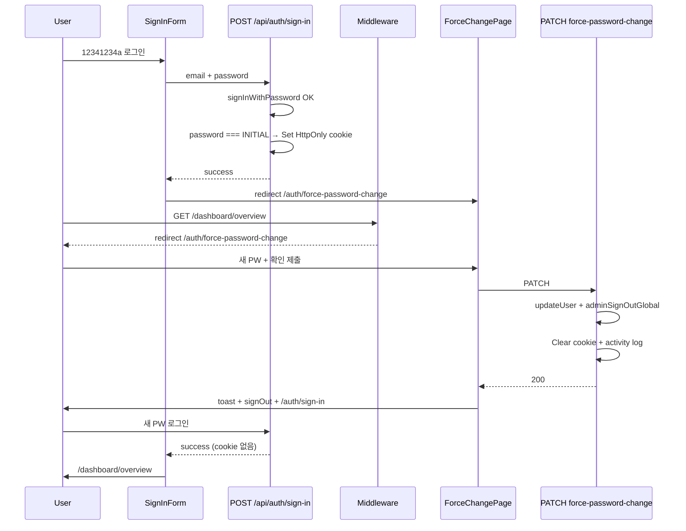

# 초기 비밀번호 강제 변경 (Force Initial Password Change) 기획서

> Date: 2026-08-20  
> Status: Approved  
> Author: planner  
> **SQL:** 해당 없음  
> **선행:** [07](./07_auth-route-guard-plan.md), [08](./08_activity-audit-log-plan.md), [11](./11_password-policy-set-password-removal-plan.md), [17](./17_user-management-add-flow-plan.md), [36](./36_password-reset-otp-plan.md)

## 선행 plan 참조

| Plan | 관계 |
|------|------|
| **07** | **재사용** — middleware + dashboard layout 이중 가드 (defense in depth) |
| **08** | **필수** — mutation Route 전 HTTP 분기 `recordActivityLog` · `x-request-id` |
| **11** | **정합** — 비밀번호 정책(`src/lib/password.ts`) · set-password 경로 없음 유지 |
| **17** | **supersede** — 「최초 로그인 비밀번호 변경 강제 없음」→ **본 plan In**. 초기 PW `12341234a`·`POST /api/users` 생성 흐름은 **유지** |
| **36** | **패턴 재사용** — `adminSignOutGlobal` · 변경 후 전역 로그아웃 · `/api/profile/password` Route 구조 |
| **34** | **재사용** — sign-in 이메일 로컬+도메인 UI (`LoginDomainCombobox`) |

**중복 금지:** `/auth/set-password` 재도입 · DB 컬럼/migration · OTP 임시 PW 강제 변경 · `ProfilePasswordSheet`(현재 PW 필수) 재사용 **Out**.

---

## 한 줄 요약

관리자가 `12341234a`로 생성한 계정이 **최초 로그인 시** HttpOnly 쿠키 `must_change_initial_password=1`을 받고, **대시보드·API 전체를 차단**한 뒤 `/auth/force-password-change`에서만 새 비밀번호를 설정한다. 변경 완료 시 **전역 로그아웃** + activity log `auth.force_password_change`를 기록한다.

---

## 목표 & 완료 기준

- `12341234a` 로그인 → force-change 페이지만 접근 가능 (dashboard 셸 미노출)
- URL 직접 입력·API 호출 우회 차단 (middleware allowlist + layout 이중)
- 안내 문구 「12341234a 비밀번호는 사용할 수 없습니다. 비밀번호를 변경해 주세요」
- 변경 성공 → 쿠키 삭제 + `adminSignOutGlobal` + sign-in redirect
- `PATCH /api/auth/force-password-change` 전 HTTP 분기 activity log
- Playwright UI/API spec green · tsc · lint · build 통과

---

## 범위 (In / Out)

### In Scope

| # | 영역 | 내용 |
|---|------|------|
| 1 | **쿠키** | HttpOnly `must_change_initial_password=1` — 로그인(초기 PW) 시 set · 변경 성공·로그아웃 시 clear |
| 2 | **BE — sign-in** | `POST /api/auth/sign-in` — 서버 `signInWithPassword` + 초기 PW 일치 시 쿠키 set (**activity log Out**) |
| 3 | **BE — force-change** | `PATCH /api/auth/force-password-change` — current PW **없음** · `updateUser` · `adminSignOutGlobal` · 쿠키 clear |
| 4 | **BE — middleware** | 쿠키 presence 시 dashboard redirect · API allowlist(화이트리스트) · logged-in auth path 분기 |
| 5 | **BE — 공유 상수** | `src/lib/auth/initial-password.ts` · `src/lib/auth/must-change-cookie.ts` |
| 6 | **FE — sign-in** | `user-auth-form` → API sign-in 경유 · 초기 PW 시 `/auth/force-password-change` redirect |
| 7 | **FE — force-change page** | `/auth/force-password-change` · 전용 폼(mutation) · 안내 Alert |
| 8 | **FE — layout 가드** | `auth/force-password-change/layout.tsx` · `dashboard/layout.tsx` 이중 redirect |
| 9 | **activity log** | `auth.force_password_change` types/labels · Route 전 분기 |
| 10 | **E2E** | `e2e/auth/force-password-change.spec.ts` · `e2e/auth/force-password-change.api.spec.ts` |
| 11 | **회귀** | `e2e/users/list.spec.ts` 등 `12341234a` 로그인 테스트 force-change 흐름 반영 |

### Out of Scope

| 항목 | 비고 |
|------|------|
| SQL · RLS · `profiles` 스키마 변경 | Out — 쿠키만 사용 |
| OTP 임시 비밀번호(plan 36) 강제 변경 | Out — `12341234a`만 대상 |
| `INITIAL_USER_PASSWORD` 값 변경 | Out — `12341234a` 유지 |
| 기존 사용자 일괄 마이그레이션 | Out — **다음 로그인** 시 쿠키 set |
| `ProfilePasswordSheet` 수정 | Out — nav-user 일반 변경 경로 유지 |
| sign-in rate limit | Out — 인프ra 후속 |
| `/auth/set-password` 재도입 | Out — plan 11 유지 |

### plan 17 supersede

| plan 17 항목 | plan 44 |
|--------------|---------|
| 최초 로그인 비밀번호 변경 강제 **하지 않음** | **In** — 본 plan |
| 초기 PW `12341234a` | **유지** |
| `password_set_at: now()` on create | **유지** (감지는 쿠키, DB 가드 아님) |

---

## 사용자 플로우

---

## UI 요구사항

### 공통

- **언어:** 한국어
- **레이아웃:** sign-in과 동일 auth shell (`src/app/auth/layout.tsx`) — **dashboard 셸(사이드바·헤더) 미노출**
- **로딩:** `src/app/auth/force-password-change/loading.tsx` — `PageLoadingSpinner variant="default"`
- **아이콘:** `Icons.*` only
- **폼:** `useAppForm` + `useFormFields` · 성공 시 `form.reset()` · 실패 시 reset 금지

### `/auth/force-password-change`

| 항목 | 요구 |
|------|------|
| **페이지 제목** | 「비밀번호 변경」 (또는 designer와 동일 톤) |
| **안내 Alert** | 「12341234a 비밀번호는 사용할 수 없습니다. 비밀번호를 변경해 주세요」 — **정확히 이 문구** |
| **필드** | `new_password` · `confirm_password` — **current_password 없음** |
| **정책** | plan 11 — 8자 이상 · 영문+숫자 (`passwordFieldSchema`) |
| **금지 PW** | 새 PW가 `12341234a`이면 클라이언트·API validation 에러 |
| **CTA** | 「비밀번호 변경」 — `isLoading`/`isPending` |
| **성공** | toast 「비밀번호가 변경되었습니다. 다시 로그인해 주세요.」 → client `signOut` → `/auth/sign-in` |
| **SheetFooter** | N/A (페이지 폼) |

### sign-in 변경

| 항목 | 요구 |
|------|------|
| **로그인 경로** | `POST /api/auth/sign-in` (서버 Route) — HttpOnly 쿠키 set 가능 |
| **redirect** | 쿠키 set 시 `/auth/force-password-change` · 아니면 기존 `redirectTo`/`/dashboard/overview` |
| **UX** | plan 34 이메일 로컬+도메인 UI **유지** |

---

## API / BE 요구사항

### `POST /api/auth/sign-in` (신규)

| 항목 | 내용 |
|------|------|
| **Body** | `{ email, password }` — sign-in schema |
| **동작** | inactive 차단 · `signInWithPassword` · 성공 시 profile 확인 |
| **쿠키 set** | `password === INITIAL_USER_PASSWORD` → `must_change_initial_password=1` HttpOnly, `SameSite=Lax`, `Path=/` |
| **응답** | `{ success: true }` + `mustChange: boolean` (FE redirect용) |
| **activity log** | **Out** — 로그인 |

### `PATCH /api/auth/force-password-change` (신규)

| 항목 | 내용 |
|------|------|
| **인증** | `requireSession()` + 쿠키 `must_change_initial_password=1` **동시** — 없으면 403 |
| **Body** | `{ new_password, confirm_password }` — current_password **없음** |
| **validation** | `passwordFieldSchema` · confirm 일치 · `new_password !== INITIAL_USER_PASSWORD` |
| **mutation** | `supabase.auth.updateUser({ password })` — current_password 파라미터 **미사용** |
| **후처리** | `adminSignOutGlobal(userId)` · 쿠키 clear (`maxAge=0`) |
| **응답 200** | `{ success: true, message: '비밀번호가 변경되었습니다. 다시 로그인해 주세요.' }` |

### middleware allowlist

**쿠키 `must_change_initial_password=1` + 세션 있을 때만 적용**

| 허용 | 경로 |
|------|------|
| Page | `/auth/force-password-change` |
| API POST | `/api/auth/sign-in` |
| API PATCH | `/api/auth/force-password-change` |

**차단**

| 대상 | 동작 |
|------|------|
| `/dashboard/*` | redirect → `/auth/force-password-change` |
| 기타 `/auth/*` (force-change 제외) | redirect → `/auth/force-password-change` |
| allowlist 외 `/api/*` | 403 JSON `{ success: false, message: '...' }` |

**쿠키 없을 때**

| 대상 | 동작 |
|------|------|
| `/auth/force-password-change` | redirect → `/auth/sign-in` |
| logged-in + `/auth/sign-in` | 기존 plan 07 — dashboard redirect (**쿠키 없을 때만**) |

### layout 이중 가드

| 파일 | 동작 |
|------|------|
| `src/app/auth/force-password-change/layout.tsx` | 세션 필수 + 쿠키 필수 — 미충족 시 redirect |
| `src/app/dashboard/layout.tsx` | 쿠키 presence → redirect `/auth/force-password-change` |

### 공유 모듈

| 파일 | 내용 |
|------|------|
| `src/lib/auth/initial-password.ts` | `INITIAL_USER_PASSWORD = '12341234a'` — `users/route.ts` import 전환 |
| `src/lib/auth/must-change-cookie.ts` | 쿠키명 상수 · set/clear/has 헬퍼 |

---

## 활동 감사 로그 (기록 연동)

> `core-conventions.mdc` §활동 감사 로그 · [plan 08](./08_activity-audit-log-plan.md)

### In

| Route | action | targetType |
|-------|--------|------------|
| `PATCH /api/auth/force-password-change` | `auth.force_password_change` | `auth` |

### Out

- `POST /api/auth/sign-in` — 로그인
- client `signOut()` — 로그아웃
- middleware redirect — READ

### `PATCH /api/auth/force-password-change` — return 분기 매트릭스

| Return | HTTP | metadata.error_code (예) |
|--------|------|--------------------------|
| 미인증 | 401 | `unauthenticated` |
| 쿠키 없음/불일치 | 403 | `forbidden` |
| Zod validation | 400 | `validation` |
| 새 PW = `12341234a` | 400 | `validation` |
| updateUser 실패 | 400 | `validation` |
| adminSignOutGlobal 실패 | 500 | `internal_error` |
| 성공 | 200 | `{}` |
| catch | 500 | `internal_error` |

**metadata 금지:** 평문 password · token · 임시비밀번호

### types/labels 추가

- `ActivityAction`: `'auth.force_password_change'`
- `ACTION_LABELS`: `'초기 비밀번호 강제 변경'`

---

## AC (Given-When-Then)

| # | 검증 | Given | When | Then |
|---|------|-------|------|------|
| AC-1 | Playwright | admin이 생성한 active 계정(초기 PW `12341234a`) | sign-in 제출 | URL `/auth/force-password-change` · 안내 「12341234a 비밀번호는 사용할 수 없습니다. 비밀번호를 변경해 주세요」 |
| AC-2 | Playwright | AC-1 상태 | 주소창 `/dashboard/overview` | `/auth/force-password-change` redirect · dashboard 셸 미노출 |
| AC-3 | Playwright | AC-1 상태 | 주소창 `/dashboard/users` | `/auth/force-password-change` redirect |
| AC-4 | API | AC-1 세션·쿠키 | `GET /api/notifications` | HTTP **403** · `{ success: false }` |
| AC-5 | Playwright | AC-1 상태 | force-change 폼에 새 PW `12341234a` 제출 | validation 에러 · 제출 차단 |
| AC-6 | Playwright | AC-1 상태 | 정책 충족 새 PW + 확인 일치 제출 | 성공 토스트 · `/auth/sign-in` redirect |
| AC-7 | Playwright | AC-6 완료 후 | 새 PW로 sign-in | `/dashboard/overview`(또는 redirectTo) · force-change redirect **없음** |
| AC-8 | Playwright | 비로그인 | `/auth/force-password-change` 직접 | `/auth/sign-in` redirect |
| AC-9 | Playwright | PW 변경 완료 계정 | sign-in | force-change redirect **없음** |
| AC-10 | API | AC-6 성공 직후 | `GET /api/activity-logs?action=auth.force_password_change` (admin) | `x-request-id` 행 **1건** · metadata에 평문 PW **없음** |
| AC-11 | API | force-change API | validation/401/403/500 각 분기 | `auth.force_password_change` log **분기별 1건** |
| AC-12 | CLI | — | `npm run build` | 통과 |

**회귀:** plan 07 미로그인 dashboard 차단 · plan 11 set-password 404 · plan 34 sign-in UX · plan 36 OTP reset **유지**.

---

## 영향 파일 & 패턴

### Backend (예상)

| 파일 | 변경 |
|------|------|
| `middleware.ts` | 쿠키 가드 · API allowlist |
| `src/lib/auth/initial-password.ts` | 신규 — 상수 공유 |
| `src/lib/auth/must-change-cookie.ts` | 신규 — 쿠키 헬퍼 |
| `src/app/api/auth/sign-in/route.ts` | 신규 |
| `src/app/api/auth/force-password-change/route.ts` | 신규 |
| `src/app/api/users/route.ts` | 상수 import |
| `src/features/activity-logs/api/types.ts` | action 추가 |
| `src/features/activity-logs/labels.ts` | 라벨 추가 |

### Frontend (예상)

| 파일 | 변경 |
|------|------|
| `src/features/auth/components/user-auth-form.tsx` | API sign-in |
| `src/features/auth/api/service.ts` | sign-in API 경유 |
| `src/features/auth/schemas/force-password.ts` | 신규 |
| `src/features/auth/api/mutations.ts` | force-change mutation |
| `src/features/auth/components/force-password-change-form.tsx` | 신규 |
| `src/app/auth/force-password-change/page.tsx` | 신규 |
| `src/app/auth/force-password-change/loading.tsx` | 신규 |
| `src/app/auth/force-password-change/layout.tsx` | 신규 |
| `src/app/dashboard/layout.tsx` | 쿠키 redirect |

### E2E (예상)

| 파일 | 변경 |
|------|------|
| `e2e/auth/force-password-change.spec.ts` | 신규 — AC-1~9 |
| `e2e/auth/force-password-change.api.spec.ts` | 신규 — AC-10~11 |
| `e2e/users/list.spec.ts` | 회귀 — force-change 흐름 |

### 참조 패턴

- `src/app/api/profile/password/route.ts` — activity log · `adminSignOutGlobal`
- `src/app/api/auth/forgot-password/verify/route.ts` — 전역 로그아웃
- `middleware.ts` `isPublicAuthApiPath` — allowlist 확장

---

## 리스크 & 완화책

| 우선순위 | 리스크 | 완화 |
|----------|--------|------|
| HIGH | 클라이언트-only 로그인 → HttpOnly 쿠키 불가 | `POST /api/auth/sign-in` **필수** (Phase 2 확정) |
| HIGH | middleware allowlist 누락 → 우회 | 화이트리스트 + layout 이중 · AC-2~4 |
| HIGH | current PW 없이 타인 PW 변경 | session + 쿠키 **동시** 검증 |
| MED | 새 PW = `12341234a` 재설정 | schema + API refine · AC-5 |
| MED | sign-out 후 쿠키 잔존 | 성공 응답·sign-out path에서 clear |
| MED | E2E `12341234a` 회귀 | list.spec 등 helper 갱신 |

---

## 롤백

middleware·쿠키 로직 제거 → sign-in 클라이언트 direct 복원 → 신규 Route·page 삭제. DB 변경 없음.

---

## 팀 전달 메모

### — /designer 에게 —

- **UI 범위:** `/auth/force-password-change` 단일 auth 카드 — sign-in/forgot-password 톤 정합
- **필수:** Alert 안내 문구 정확히 「12341234a 비밀번호는 사용할 수 없습니다. 비밀번호를 변경해 주세요」
- **필드:** 새 비밀번호 + 확인만 (현재 비밀번호 필드 **없음**)
- **참고:** `src/app/auth/sign-in/` · forgot-password 카드 레이아웃

### — /backend-dev 에게 —

- **Route:** `POST /api/auth/sign-in` (log Out) · `PATCH /api/auth/force-password-change` (log In)
- **middleware:** 쿠키 기반 dashboard/API allowlist
- **패턴:** `profile/password` · `adminSignOutGlobal` · plan 08 전 분기 log
- **SQL:** 없음

### — /frontend-dev 에게 —

- **범위:** sign-in API 연동 · force-change page/form/mutation · dashboard layout redirect
- **패턴:** `useAppForm` · `mutations.ts` `onSettled` invalidate · 성공 시 `form.reset()`
- **금지:** `ProfilePasswordSheet` 재사용 · service 직접 mutation

### — /verifier 에게 —

- **spec:** `e2e/auth/force-password-change.spec.ts` · `force-password-change.api.spec.ts`
- **AC:** 위 AC-1~12 · activity log API 분리 검증
- **회귀:** `e2e/users/list.spec.ts` · sign-in-email-split

---

## 수정 이력

| 날짜 | 변경 내용 | 작성자 |
|------|----------|--------|
| 2026-08-20 | 최초 작성 (Approved) | planner |
