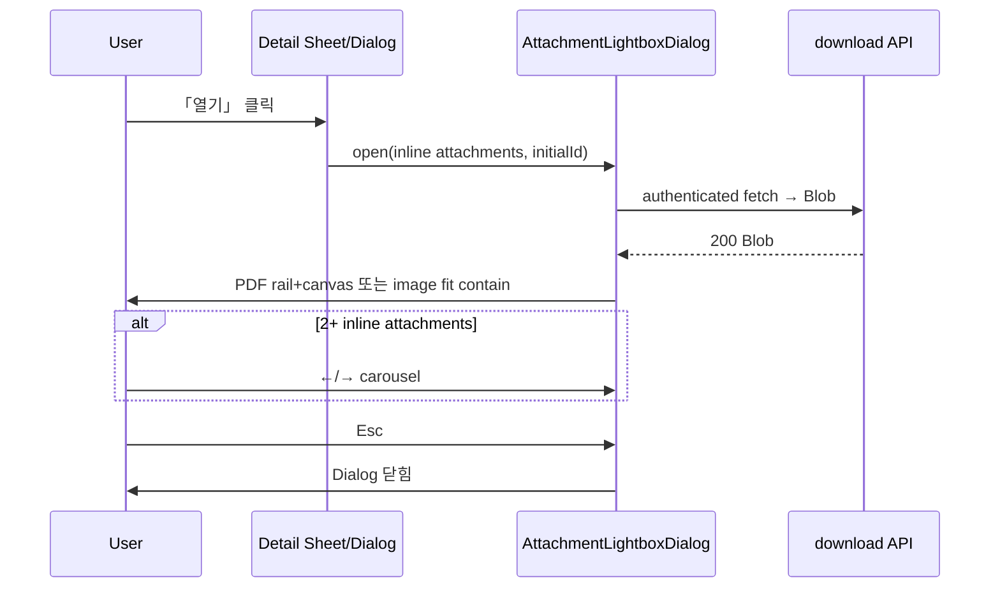

# 계약·공지 첨부 Modal Lightbox Viewer 기획서

> Date: 2026-10-08
> Status: Completed
> Author: planner
> **선행:** [07](./07_auth-route-guard-plan.md), [16](./16_contract-management-plan.md), [38](./38_contract-attachment-size-limit-plan.md), [39](./39_announcements-plan.md), [41](./41_user-my-contracts-plan.md), [48](./48_contract-attachment-viewer-tab-title-plan.md) (**supersede**)

## 한 줄 요약

계약(admin·user 내 계약)·공지 첨부 「열기」를 **Slack 스타일 전체화면 Dialog lightbox**로 통일한다. PDF는 **react-pdf** + 좌측 페이지 썸네일 rail, 이미지는 fit contain 단일 뷰. inline 가능 첨부 **2개 이상**이면 **embla carousel**로 ←/→ 파일 간 이동(모바일·태블릿·PC 동일 UX). plan 48의 iframe viewer page·새 탭 flow는 **완전 제거**한다.

---

## 선행 plan 참조

| Plan | Status | 관계 |
|------|--------|------|
| **07** | Completed | dashboard·`/api/*` defense in depth — download API RBAC **재사용** |
| **16** | Approved | admin 계약 첨부 download·`canOpenContractAttachment` — download Route **재사용**, mutation **변경 없음** |
| **38** | Completed | inline 판정·**10MB/50MB** — lightbox fetch·렌더도 **동일 상한** |
| **39** | Approved | 공지 첨부 download = **전 authenticated** — 동일 auth |
| **41** | Approved | user 내 계약 첨부 열기 — **AC-07 supersede** (plan 72 AC-02로 이전) |
| **48** | **Cancelled** | iframe viewer page + 새 탭 — **본 plan이 supersede** |

### plan 48 supersede

| 항목 | plan 48 (Cancelled) | plan 72 (본 plan) |
|------|---------------------|-------------------|
| UX | viewer page + iframe + **새 탭** | **전체화면 Dialog lightbox** (같은 탭) |
| PDF | 브라우저 iframe PDF 뷰어 | **react-pdf** + page thumbnail rail |
| 탭 title | `metadata.title = file_name` | Dialog **header에 fileName** |
| carousel | 없음 | inline 첨부 2+ → **embla carousel** |
| viewer route | 3× `/dashboard/.../view` | **삭제 → 404** |
| E2E | 새 탭·iframe·title | Dialog·canvas/img |

### plan 41 AC-07 supersede

| 항목 | plan 41 (기존) | plan 72 |
|------|----------------|---------|
| AC-07 Then | 새 탭 inline 미리보기 | **Dialog** inline 미리보기 (PDF canvas / image visible) |

---

## deep-interview · battle-plan 확정사항

| # | 항목 | 확정 |
|---|------|------|
| 1 | viewer route | **(A) 완전 삭제** — `(viewer)` route group·page·loading.tsx 제거, 직접 URL → **404** |
| 2 | PDF 데이터 | **(A) authenticated fetch → Blob → react-pdf**; pdfjs worker public/static 또는 CDN; **10MB PDF 동일 경로 허용** |
| 3 | carousel | 한 row PDF+이미지 혼합 시 **←/→ 파일 간 이동 필수**; PDF slide=rail+본문, 이미지 slide=rail 숨김·fit contain |
| 4 | keyboard | `Esc`=닫기 · `←/→`=첨부 간 · PDF 포커스/rail에서 `↑/↓`=페이지 |
| 5 | 외부 탭 | `openContractAttachment` / `openMyContractAttachment` / `openAnnouncementAttachment` 및 새 탭 flow **완전 제거** |
| 6 | designer | GenerateImage **PC/태블릿/모바일 목업 3장** → 사용자 **「디자인 확인」** 또는 `승인` 후 FE |
| 7 | BE | download API **재사용·수정 없음**; READ-only |
| 8 | E2E | plan 48 UI spec **삭제** → Dialog 기반 lightbox spec **신규** |

---

## 목표 & 완료 기준

### 목표

- inline 가능 첨부(PDF·이미지, `canOpen*` / `isInlineOpenableAttachment` 기준) 「열기」 시 **같은 탭 전체화면 Dialog**에서 미리보기한다.
- PDF는 react-pdf로 렌더하고 좌측 **page thumbnail rail**로 페이지를 선택한다.
- 이미지는 rail 없이 **fit contain** 단일 뷰로 표시한다.
- 한 row에 inline 가능 첨부가 **2개 이상**이면 embla carousel로 파일 간 이동한다(모바일·태블릿·PC 동일).
- Blob fetch는 기존 authenticated download API만 사용한다(RBAC·IDOR 방어 유지).
- plan 48 viewer page·새 탭 flow를 제거하고 READ-only로 완료한다.

### 완료 기준 (AC)

| # | 검증 | Given | When | Then |
|---|------|-------|------|------|
| AC-01 | Playwright | admin 로그인, 계약 상세에 inline 가능 PDF 활성 첨부(예: `계약서.pdf`) | 「열기」 클릭 | **같은 탭** `getByRole('dialog')` visible · header **`계약서.pdf`** · PDF **canvas** visible · **새 탭 미발생** |
| AC-02 | Playwright | `system_role=user`, 본인 `author_name` 매칭 계약, inline 가능 PDF 첨부 | 내 계약 상세 Sheet에서 「열기」 클릭 | Dialog visible · header 원본 `file_name` · canvas visible (**plan 41 AC-07 supersede**) |
| AC-03 | Playwright | authenticated user, 공지 상세 Dialog에 inline 가능 PDF 첨부 | 「열기」 클릭 | Dialog visible · header 원본 `file_name` · canvas visible |
| AC-04 | Playwright | inline **불가** 활성 첨부(예: `.bin`, `canOpen*` false) | 상세 UI 확인 | 「열기」 버튼 **없음** · 「다운로드」만 동작 |
| AC-05 | Playwright | user A 세션, user B 매칭 계약의 download API | `GET /api/my-contracts/{id}/attachments/{aid}/download` 직접 호출 | HTTP **403** |
| AC-06 | Playwright | `system_role=user` | plan 48 viewer URL `/dashboard/contracts/{id}/attachments/{aid}/view` 직접 접근 | HTTP **404** (Next not-found) |
| AC-07 | API | 기존 download spec fixture | `GET /api/contracts/.../download`, `GET /api/my-contracts/.../download`, `GET /api/announcements/.../download` | HTTP **200** · `content-disposition`·파일명 **회귀 없음** (download Route **미변경**) |
| AC-08 | Playwright | admin, inline PDF+PNG **2개** active | PDF 「열기」 | Dialog · carousel **2슬라이드** · `다음`/`→` 클릭 시 **이미지** slide(rail 숨김, img visible) |
| AC-09 | Playwright | AC-08 상태 | `이전`/`←` 클릭 | PDF slide 복귀 · thumbnail rail visible |
| AC-10 | Playwright | Dialog open | `Escape` | Dialog **닫힘** |
| AC-11 | Playwright | 3-page PDF, Dialog open | PDF rail 2번째 썸네일 클릭 | 본문 **2페이지** 표시 |
| AC-12 | Playwright | Dialog PDF slide focused | `ArrowDown` | 다음 PDF 페이지 표시 |
| AC-13 | Playwright | admin | `/dashboard/overview` 등 `/dashboard/*` 하위 페이지 | `dashboard/layout.tsx` **`DashboardPresenceTrack` 상속** — lightbox가 presence track을 깨지 않음 |

---

## 범위 (In / Out)

### In Scope

| 영역 | 내용 |
|------|------|
| **FE 공유** | `AttachmentLightboxDialog` + PDF/Image viewer + embla carousel + keyboard |
| **FE 연동** | `contract-detail-sheet`, `contract-edit-sheet`, `my-contract-detail-sheet`, `announcement-attachment-list` |
| **FE 제거** | `(viewer)` route group 3곳, `open*`, `get*ViewerUrl`, `AttachmentViewerFrame` |
| **FE dep** | `react-pdf`, `pdfjs-dist` (worker 설정) |
| **BE** | 기존 download API **재사용·수정 없음** |
| **E2E** | plan 48 UI spec 삭제 → `e2e/attachments/lightbox-*.spec.ts` 신규; download API regression **유지** |
| **designer** | GenerateImage PC/태블릿/모바일 lightbox 목업 **3장** |

### Out Scope

- download Route·Storage·`Content-Disposition` 변경
- 첨부 CUD·계약/공지 mutation·bulk ZIP 변경
- non-inline 첨부 lightbox 제공
- signed URL / iframe 병행
- viewer route redirect·안내 page (→ **404**)
- PDF 주석·인쇄·zoom UI 커스텀
- activity log 신규 action
- SQL migration
- CSV/Excel export

---

## UI 요구사항

### Lightbox Dialog (공통)

| 항목 | 내용 |
|------|------|
| **패턴** | Slack file preview — **전체화면 Dialog**, dark backdrop, header=**fileName** + 닫기(`Esc` 동일) |
| **레이아웃** | `DialogContent`: `fixed inset-0 max-w-none h-dvh` · body flex · carousel 영역 flex-1 |
| **로딩** | Blob fetch 중 `PageLoadingSpinner variant="compact"` |
| **에러** | fetch 403/404/네트워크 → 한국어 toast(예: 「첨부파일을 불러올 수 없습니다.」) · Dialog 유지 또는 닫기 |
| **아이콘** | 「열기」 버튼: `Icons.externalLink` → `Icons.eye` 또는 `Icons.maximize` (`@/components/icons` only) |
| **접근성** | Dialog `aria-labelledby`=fileName · PDF rail `role="tablist"` 또는 button per page · carousel `aria-label` |

### PDF slide

- **react-pdf** `Document` / `Page`
- 좌측 **page thumbnail rail** (세로 scroll) — 클릭 시 본문 페이지 전환
- **키보드:** PDF slide/rail 포커스 시 `ArrowUp`/`ArrowDown` = 이전/다음 페이지
- plan 38 **10MB** PDF 동일 경로 허용

### Image slide

- `` **object-contain**, max viewport
- thumbnail rail **숨김**

### Carousel (inline 첨부 2+)

- shadcn `Carousel` (`embla-carousel-react`)
- **←/→** = 첨부(파일) 간 이동 — PDF+이미지 **혼합 row 필수 지원**
- 슬라이드 타입별 adaptive layout (PDF rail vs image only)
- 첨부 1개면 carousel UI·arrow **숨김**
- 모바일·태블릿·PC **동일 UX** (touch swipe + keyboard)

### designer deliverable (`승인` 게이트 **이후**)

| # | viewport | 필수 요소 |
|---|----------|-----------|
| 1 | Desktop ≥1024px | full Dialog · PDF rail+본문 · carousel dots/arrows |
| 2 | Tablet ~768px | rail 접힘/토글 1안 |
| 3 | Mobile ~375px | rail bottom sheet 또는 숨김 · header sticky · swipe |

**게이트:** GenerateImage 3장 → 사용자 **「디자인 확인」** 또는 `승인` → FE 구현

### 기존 listing/detail (변경 최소)

- 「열기」 label **유지** · 클릭 시 Dialog (새 탭 **금지**)
- `canOpen*` false — 기존과 동일 「열기」 숨김
- 다운로드 flow **유지** (기존 Blob download)

---

## API / Service Layer

### download Route (재사용 · 수정 없음)

| Method | Path | Guard |
|--------|------|-------|
| GET | `/api/contracts/[id]/attachments/[attachmentId]/download` | `requireAdminSession` |
| GET | `/api/my-contracts/[id]/attachments/[attachmentId]/download` | `requireUserSession` + `assertMyContractAccess` |
| GET | `/api/announcements/[id]/attachments/[attachmentId]/download` | `requireSession` |

### FE fetch (신규 · READ)

- Dialog/slide mount 시 **authenticated fetch** → `Blob` (기존 `downloadContractAttachment` / `downloadMyContractAttachment` / `downloadAnnouncementAttachment` 패턴)
- `URL.createObjectURL(blob)` → react-pdf / ``
- unmount/slide change 시 `URL.revokeObjectURL`

### 제거 (plan 48)

| 함수/경로 | 처리 |
|-----------|------|
| `getContractAttachmentViewerUrl` | **삭제** |
| `getMyContractAttachmentViewerUrl` | **삭제** |
| `getAnnouncementAttachmentViewerUrl` | **삭제** |
| `openContractAttachment` | **삭제** |
| `openMyContractAttachment` | **삭제** |
| `openAnnouncementAttachment` | **삭제** |
| `src/app/dashboard/(viewer)/` | **전체 삭제** |

### Feature 구조

```txt
src/features/attachments/
  api/
    types.ts                    — AttachmentLightboxItem, LightboxSource
    fetch-attachment-blob.ts    — source별 download 래퍼
  components/
    attachment-lightbox-dialog.tsx
    attachment-lightbox-carousel.tsx
    attachment-pdf-viewer.tsx
    attachment-image-viewer.tsx

src/features/contracts/api/service.ts       — open*/viewerUrl 제거, canOpen*/download* 유지
src/features/announcements/api/service.ts   — 동일

package.json                                — react-pdf, pdfjs-dist 추가
public/pdf.worker.min.mjs                   — [INFERRED] worker static
```

**mutations.ts:** **변경 없음** (CUD 없음)

---

## 권한 / RBAC

| Source | download API | admin | user (매칭) | user (비매칭) | unauthenticated |
|--------|--------------|-------|-------------|---------------|-----------------|
| admin 계약 | `/api/contracts/.../download` | ✅ | ❌ 403 | ❌ 403 | ❌ |
| 내 계약 | `/api/my-contracts/.../download` | ❌ 403 | ✅ scope 내 | ❌ 403 | ❌ |
| 공지 | `/api/announcements/.../download` | ✅ | ✅ | ✅ | ❌ |

- nav 숨김은 UX — **download API 서버 가드**가 최종 방어 (plan 07)
- 구 viewer URL 직접 접근 → **404** (AC-06)
- Lightbox는 download API 경유만 — Storage path 클라이언트 직접 접근 **금지**

---

## 활동 감사 로그

**activity log 해당 없음** — lightbox·download GET 모두 READ. plan 08·16·41·39·48 정책과 동일하게 **기록하지 않음**. CUD Route **없음**.

---

## E2E spec 구조

**삭제 (plan 48 · 새 탭 전용)**

- `e2e/contracts/attachment-viewer.spec.ts`
- `e2e/contracts/my-contracts-viewer.spec.ts`
- `e2e/announcements/attachment-viewer.spec.ts`

**유지**

- `e2e/contracts/attachment-viewer.api.spec.ts` — AC-07 download regression

**신규**

```
e2e/attachments/
  lightbox-admin.spec.ts          — AC-01, AC-04, AC-06, AC-08~10
  lightbox-my-contracts.spec.ts   — AC-02, AC-05
  lightbox-announcements.spec.ts  — AC-03
  lightbox-pdf-pages.spec.ts      — AC-11, AC-12
```

- 셀렉터: `getByRole('dialog')` · `getByRole('button', { name: /열기/ })` · carousel `getByRole('button', { name: 'Next slide' })` 등
- **`context.waitForEvent('page')` 금지**
- 인증: `storageState` 재사용

---

## 영향 파일 & 패턴

| 파일 | 변경 |
|------|------|
| `src/features/attachments/**` | **신규** lightbox compound |
| `src/features/contracts/components/contract-detail-sheet.tsx` | open → lightbox |
| `src/features/contracts/components/contract-edit-sheet.tsx` | open → lightbox |
| `src/features/contracts/components/my-contract-detail-sheet.tsx` | open → lightbox |
| `src/features/announcements/components/announcement-attachment-list.tsx` | open → lightbox |
| `src/features/contracts/api/service.ts` | open*/viewerUrl **제거** |
| `src/features/announcements/api/service.ts` | open*/viewerUrl **제거** |
| `src/app/dashboard/(viewer)/` | **삭제** |
| `src/features/attachments/components/attachment-viewer-frame.tsx` | **삭제** |
| `e2e/attachments/*.spec.ts` | **신규** |
| `e2e/contracts/attachment-viewer*.spec.ts` (UI) | **삭제** |
| `e2e/announcements/attachment-viewer.spec.ts` | **삭제** |

**SQL:** migration **불필요**

**참조 패턴:** `downloadContractAttachment` Blob fetch · shadcn `Carousel` · `announcement-detail-dialog.tsx` Dialog · plan 38 용량 상수

---

## 리스크 & 완화책

| # | 리스크 | 완화 |
|---|--------|------|
| 1 | **HIGH** 10MB PDF fetch·렌더 지연/메모리 | slide cache · compact Spinner · 실패 toast · AC-01 checkpoint |
| 2 | **HIGH** pdfjs worker SSR/번들 | `'use client'` only · public worker · dynamic import |
| 3 | **HIGH** carousel ←/→ vs PDF ↑↓ 키 충돌 | PDF slide focus 시에만 page key |
| 4 | **MED** Blob URL leak | revoke on unmount/slide change |
| 5 | **MED** 4 연동 지점 분기 | 공유 `openAttachmentLightbox({ source, parentId, attachments, initialId })` |
| 6 | **MED** plan 48 북마크 404 | 의도적 — AC-06 |
| 7 | **LOW** Playwright canvas flaky | `toBeVisible()` + load wait |
| 8 | **LOW** react-pdf bundle size | Dialog open 시 lazy load |

---

## 구현 순서 제안

1. `react-pdf` + worker spike (단일 PDF Dialog)
2. `AttachmentLightboxDialog` + PDF/Image viewers + keyboard
3. embla carousel (혼합 2+ slide)
4. contracts admin 연동 + plan 48 route/open* 제거
5. E2E AC-01 checkpoint
6. my-contracts + announcements 연동
7. E2E 전체 + API regression + viewer 404 AC-06
8. designer 목업 대조 UI polish (`승인`·디자인 확인 후)
9. tsc · lint · build

**예상:** Complex · ~5–7시간 · checkpoint Step 5 (~2.5h)

---

## requirements-pipeline Express (Phase 3)

### 가정 (Assumptions)

| ID | 가정 |
|----|------|
| A1 | plan 48 `(viewer)` route·iframe 구현 **존재** — 본 plan에서 **제거** |
| A2 | `embla-carousel-react`·shadcn `Carousel` **이미 설치** |
| A3 | download API authenticated session cookie fetch **same-origin** — CORS 추가 **불필요** |
| A4 | designer GenerateImage 3장 **FE 착수 전** 사용자 확인 필수 |

### 핵심 사용자 흐름



---

## 팀별 전달 요약

### — designer (`승인` 후) —

- **UI 범위:** GenerateImage **PC/태블릿/모바일 lightbox 목업 3장** — PDF rail·혼합 carousel·이미지 slide
- **참고:** Slack file preview · `announcement-detail-dialog.tsx` · WakeOne neutral tokens
- **게이트:** 사용자 **「디자인 확인」** 또는 `승인` 후 FE
- **Out:** PDF 툴바 커스텀

### — backend-dev —

- **범위:** download Route **수정 없음** · `(viewer)` RSC **삭제만**
- **SQL:** 없음
- **activity log:** 해당 없음 (READ-only)

### — frontend-dev —

- **범위:** `react-pdf` + worker · `AttachmentLightboxDialog` compound · embla carousel · 4 연동 · open*/viewer route **제거**
- **패턴:** feature-based · `'use client'` lightbox only · 기존 Blob download service 재사용
- **mutations.ts:** 변경 없음

### — verifier —

- **AC:** plan 72 AC-01~13 · download API AC-07 regression
- **spec:** `bunx playwright test e2e/attachments/` + `attachment-viewer.api.spec.ts`
- **grep:** plan 48 UI spec·`open*Attachment`·`(viewer)/view` **0건** (제거 확인)
- **build:** tsc · lint · build

---

## 수정 이력

| 날짜 | 변경 내용 | 작성자 |
|------|----------|--------|
| 2026-10-08 | 최초 작성 · `/root` planner Phase 3+4 · plan 48 supersede · Status Approved | planner |
